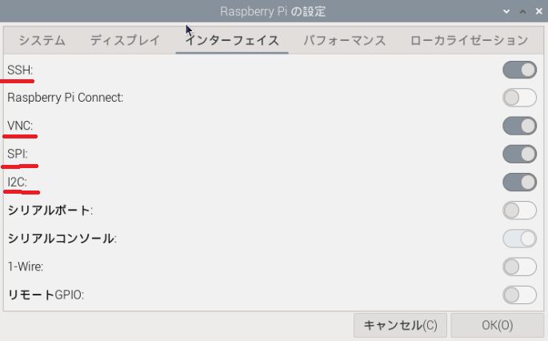
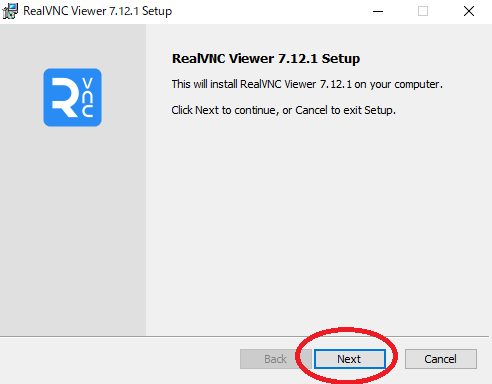
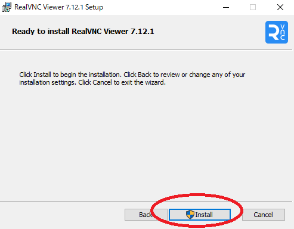
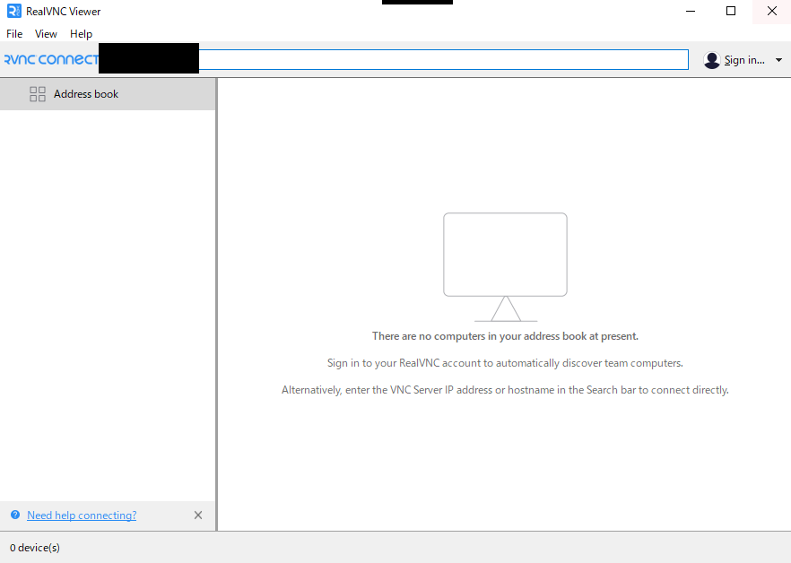
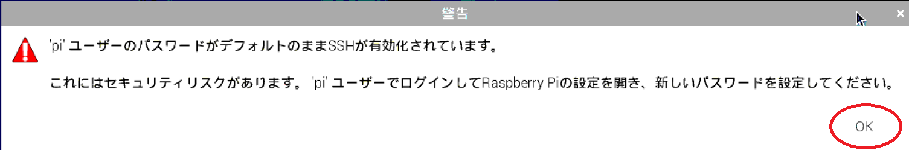
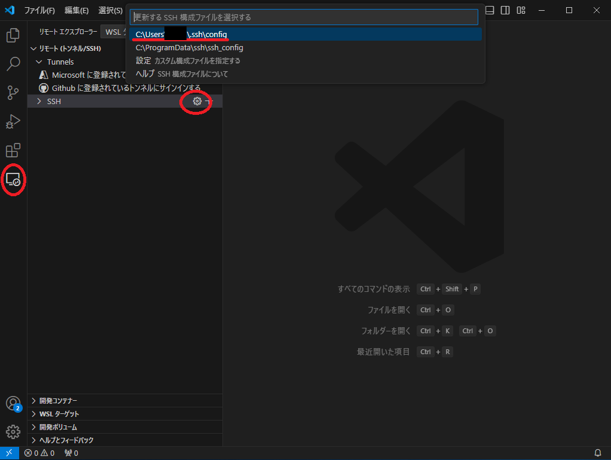

# Raspberry Piを活用したデータ処理とグラフ表示によるIoTシステム構築

## 2. 開発環境のインストールと設定

### 2.1 Raspberry Piの設定

#### 2.1.1 初期設定

* Next


* Country
    * Japan
* Language
    * Japanese
* Timezone
    * Tokyo
* Next


* Enter username
    * pi
* Enter password
    * 任意
* Confirm password
    * 上記同様
* Next


* OK


* 接続先SSIDをクリック
* Next


* password
    * 任意
* Next


* Next


* Next


* Skip


* OK


* Restart


#### 2.1.1 IPアドレスの設定

別端末からSSH接続によるリモートアクセスができるように、Raspberry PiのIPアドレス等を手動で設定します。

接続するSSIDを選択し、パスワードを入力後、`高度なオプション`から、タブ`IPv4設定`でIPアドレス及びDNSサーバーを設定します。


保存後、Raspberry Piの再起動させます。

```bash
pi@raspberrypi:~ $ sudo reboot
```

設定したIPアドレスが反省されているかを確認します。

```bash
pi@raspberrypi:~ $ ifconfig
```


#### 2.1.2 インターフェースの有効化

RaspberryPi のメニューより「RaspberryPi の設定」を開き、インターフェースのタブより`SSH`、`VNC`、`SPI`、`I2C` の項目を「有効」にして"OK"を押します。この設定でインターフェースが有効になります。




### 2.2 開発環境のインストール

#### 2.2.1 リモートデスクトップ(RealVNC)環境のインストール

* ダブルクリック


* OK


* Next



* チェックを入れる
    * Next


* Next


* Install



* Finish


* チェックを外す
    * ~~Sign in to get started~~
    * Use RealVNC Viewer without signing in


* ~~Cancel~~


* タブからRaspberry PiのIPアドレスを記入
    * Enterキー



* Continue


* チェックを入れる
    * UsernameとPasswordを記入
        * OK


* OK



* 接続完了


#### 2.2.2 VSCodeのインストール

* ダブルクリック


* 同意する
    * 次へ


* 次へ


* チェックを外す
    * 次へ


* チェックを入れる
    * 次へ


* インストール


* 待つ


* ~~チェックを外す~~
* 完了


* 起動


* サイドバー`拡張機能`
    * `japanese`と検索
        * 一番上をクリック


* Install


* Change Language and Restart


* サイドバー`拡張機能`
    * `remote dev`と検索
        * 一番上をクリック
            * インストール


* サイドバー`リモートエクスプローラ`
    * SSH > `歯車`
        * C:~/.ssh/config



* Host `Raspberrypi`
    * HostName `Raspberry PiのIPアドレス`
        * User `Pi`
            * Enterキー


* Linux


* Raspberry PiのIPアドレス
    * Enterキー


* 完了


### 2.3 Pythonの開発環境

~~まず、aptパッケージのアップデートをします。~~

~~pi@raspberrypi:~ $ sudo apt update~~

~~pi@raspberrypi:~ $ sudo apt -y upgrade~~

- インストールにかなり時間がかかってしまうので、割愛します。

本実習では、開発環境として`Python3.11`を利用します。
下記のコマンドで、既にインストールされているPythonのバージョンを確認することができます。

```bash
pi@raspberrypi:~ $ python -V
Python 3.11.2
```

Python で MySQL を取扱うことができるように、ライブラリをインストールします。

```bash
pi@raspberrypi:~ $ sudo apt -y install python3-pymysql
```

### 2.4 MariaDB(MySQL)Serverの環境構築

下記のコマンドで`MariaDB Server`をインストールします。

```bash
pi@raspberrypi:~ $ sudo apt -y install mariadb-server
```
