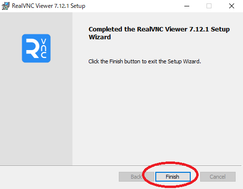
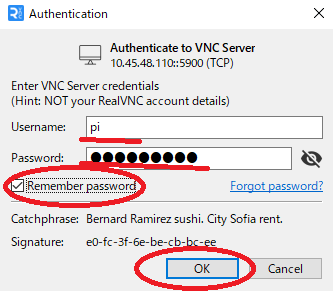
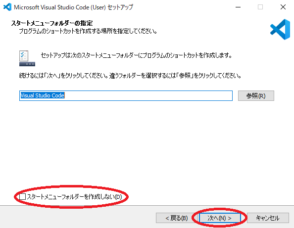
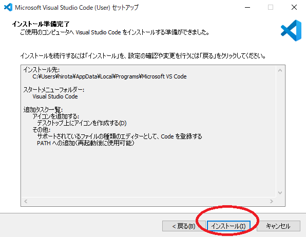
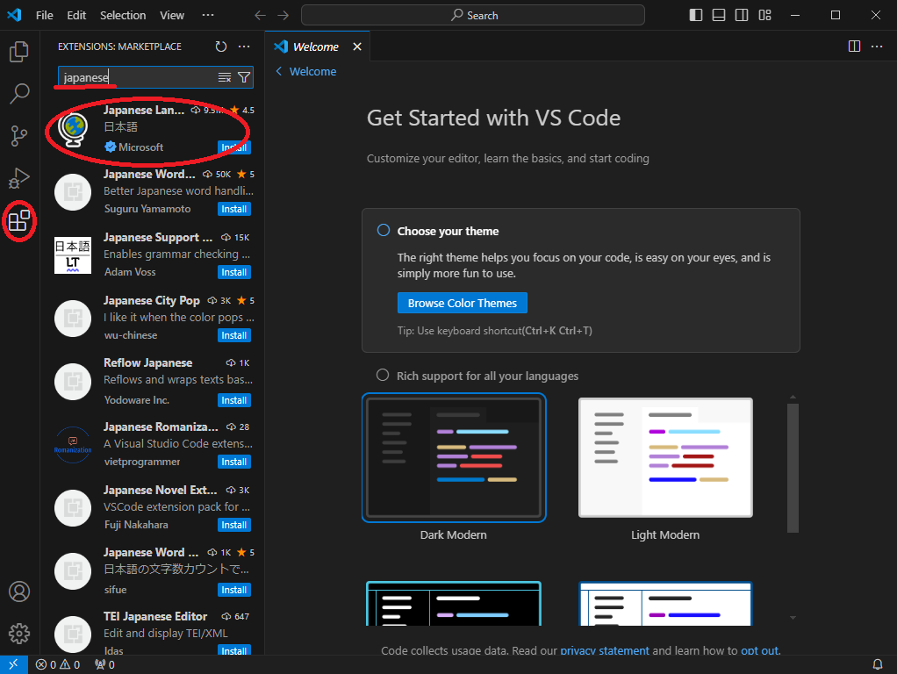
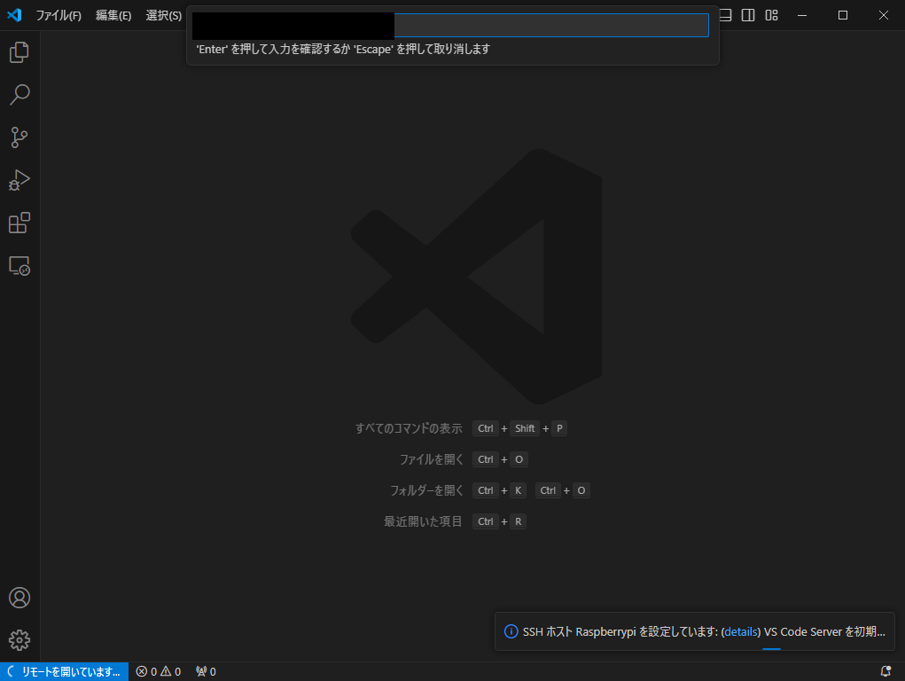
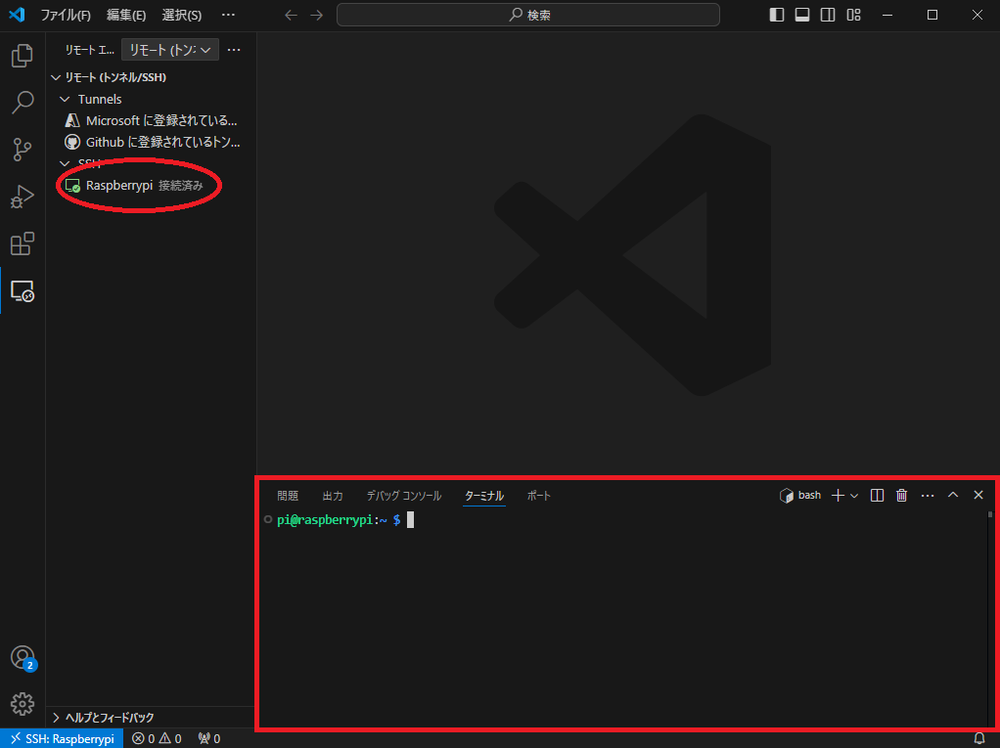

# Raspberry Piを活用したデータ処理とグラフ表示によるIoTシステム構築

## 2. 開発環境のインストールと設定

### 2.1 Raspberry Piの設定

#### 2.1.1 IPアドレスの設定


#### 2.1.2 インターフェースの有効化


RaspberryPi のメニューより「RaspberryPi の設定」を開き、インターフェースのタブより"I2C" の項目を「有効」にして"OK"を押します。この設定で I2C が有効になります。

### 2.2 開発環境のインストール

#### 2.2.1 リモートデスクトップ(RealVNC)環境のインストール








#### 2.2.2 VSCodeのインストール
















### 2.2 Pythonの開発環境

まず、aptパッケージのアップデートをします。

```bash
pi@raspberrypi:~ $ sudo apt update
```

本実習では、開発環境として`idle`を利用します。
下記のコマンドで、インストールを行ってください。すでにインストールされている場合は、実行する必要はありません。

```bash
pi@raspberrypi:~ $ sudo apt -y install idle-python3.11
```

```bash
pi@raspberrypi:~ $ sudo apt -y install python3-pymysql
```

### 2.2 MariaDB(MySQL)Serverの環境構築

下記のコマンドで`MariaDB Server`をインストールします。

```bash
pi@raspberrypi:~ $ sudo apt -y install mariadb-server
```

### 2.3 RaspberryPi の設定

