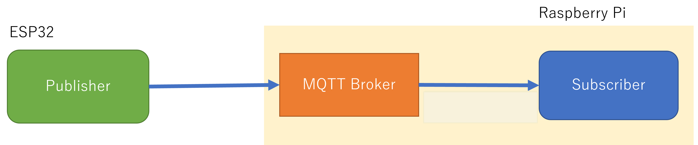

# Raspberry Piを活用したデータ処理とグラフ表示によるIoTシステム構築

## 6. MQTT経由のデータの取得と蓄積

### 6.1 MQTTの通信の仕組み

MQTTの手順で、Wi-Fiなどのネットワーク通信を用いてESP32とPC間の通信を行います。データを送信するデバイスは、ブローカと呼ばれるサーバにデータの種類を示す`topic`などと共に短い送信データを送ります。サーバは、`topic`を指定することで、受信を要望するデバイスにサーバで受信したデータのうち、要求に該当するデータを要求してきたデバイスに送信します。今回はTopicを `esp32/bme` とし，ESP32がpublisherとなりデータの送信を行い、データの取得する。



データの取得に使用するプロトコルであるMQTT通信を行うため、`mosquito`をインストールします。

```bash
pi@raspberrypi:~/python_sql $ sudo apt -y install mosquitto
```

```bash
pi@raspberrypi:~/python_sql $ sudo systemctl status mosquitto.service
```

```bash
● mosquitto.service - Mosquitto MQTT Broker
     Loaded: loaded (/lib/systemd/system/mosquitto.service; enabled; preset: enabled)
     Active: active (running) since Wed 2024-09-11 16:16:30 JST; 1min 2s ago
       Docs: man:mosquitto.conf(5)
             man:mosquitto(8)
    Process: 6633 ExecStartPre=/bin/mkdir -m 740 -p /var/log/mosquitto (code=exited, status=0/SUCCESS)
    Process: 6641 ExecStartPre=/bin/chown mosquitto /var/log/mosquitto (code=exited, status=0/SUCCESS)
    Process: 6642 ExecStartPre=/bin/mkdir -m 740 -p /run/mosquitto (code=exited, status=0/SUCCESS)
    Process: 6643 ExecStartPre=/bin/chown mosquitto /run/mosquitto (code=exited, status=0/SUCCESS)
   Main PID: 6644 (mosquitto)
      Tasks: 1 (limit: 3910)
        CPU: 50ms
     CGroup: /system.slice/mosquitto.service
             └─6644 /usr/sbin/mosquitto -c /etc/mosquitto/mosquitto.conf

 9月 11 16:16:30 raspberrypi systemd[1]: Starting mosquitto.service - Mosquitto MQTT Broker...
 9月 11 16:16:30 raspberrypi systemd[1]: Started mosquitto.service - Mosquitto MQTT Broker.
```

### 6.2 Mosquittoクライアントからのデータ取得

#### 6.2.1 サブスクライバ側の操作

MQTT通信の接続テストを行います。

* ターミナル１の操作

```bash
pi@raspberrypi:~/python_sql $ sudo apt -y install mosquitto-clients
```

MQTTブローカに接続して、データを取得します。コマンドを入力し、MQTTサブスクライバを起動します。コマンドの書式は、次のとおりです。

<code>mosquitto_sub  -d -h 接続先サーバ -p ポート番号 -t トピック名</code>

それぞれのパラメータの意味と設定値は次のとおりです。

| パラメータ | 意味 | 設定例 |
| --- | --- | --- |
| -h | サーバ名 | -h localhost |
| -p | ポート番号 | -p 1883 |
| -t | トピック名 | -t device/tochigi |

```bash
pi@raspberrypi:~/python_sql $ mosquitto_sub -h localhost -p 1883 -t test
```

```bash
Client (null) sending CONNECT
Client (null) received CONNACK (0)
Client (null) sending SUBSCRIBE (Mid: 1, Topic: test, QoS: 0, Options: 0x00)
Client (null) received SUBACK
Subscribed (mid: 1): 0
```

#### 6.2.2 パブリッシャ側の操作

* ターミナル２の操作

MQTTブローカに接続して、データを送信します。コマンドを入力し、MQTTパブリッシャを起動します。コマンドの書式は、次のとおりです。

```bash
pi@raspberrypi:~/python_sql $ mosquitto_pub -h localhost -p 1883 -t test -m "Hello MQTT!"
```

```bash
Client (null) sending CONNECT
Client (null) received CONNACK (0)
Client (null) sending PUBLISH (d0, q0, r0, m1, 'test', ... (11 bytes))
Client (null) sending DISCONNECT
```

* ターミナル１の差往査

サブスクライバ側のターミナルでメッセージが取得できているのがわかります。

```bash
Hello MQTT!
```

#### 6.3 ESP32クライアントからのデータ取得

<center>
    
</center>

### 6.3.1 配線

|信号名|AE-BME280| AE-AQM0802 |ESP32 GPIO|
|:-:|:-:|:-:|:-:|
|SCL|SCK|SCL|22|
|SDA|SDI|SDA|21|
|(アドレス選択)|SDO|-|(3.3V)|
|(電源/VDD)|VDD|VDD|(3.3V)|
|(電源/GND)|GND|GND|(GND)|

|GPIO|パーツ|
|:-:|:-:|
|14|赤LED|
|27|緑LED|
|26|黄LED|
|25|赤SW|
|33|緑SW|
|32|黄SW|


### 6.3.2 ESP32 ボードマネージャの追加

ツールメニューよりボードマネージャを選択し，`esp32` で検索を行います．
検索結果から，`esp32 by Espressif Systems` のパッケージをインストールします。

### 6.3.3 ESP32デバイスに応じたボードの選択

`ESP32 Dev Module` 等，自身が利用するデバイスとCOMXXに合わせてボードを選択します．

### 6.3.4 利用するライブラリのインストール

`タイマライブラリ`
* Ticker
  * ライブラリ検索で追加
    * [GitHub](https://github.com/sstaub/Ticker)

`BME280センサ(温度・湿度・気圧計測)ライブラリ`
* SparkFun BME280 Arduino Library
  * ライブラリ検索で追加
    * [GitHub](https://github.com/sparkfun/SparkFun_BME280_Arduino_Library)

`ST7032ライブラリ`
* AE-AQM0802
  * ライブラリ検索で追加
    * [GitHub](https://github.com/olkal/LCD_ST7032)

`MQTTプロトコルによる通信用ライブラリ`
* PubSubClient
  * ライブラリ検索で追加
    *https://pubsubclient.knolleary.net/

* ArduinoJson
  * ライブラリ検索で追加
  * https://arduinojson.org

### 6.3.5 ESP32をPublisherにして，センサ情報を送信する

以下のコードは，MQTTブローカへBME280センサで取得したデータを送信します．

```c++
/* --------------------ヘッダファイルをインクルード-------------------- */
#include <ArduinoJson.h>
#include <SparkFunBME280.h>
#include <LCD_ST7032.h>
#include <Ticker.h>
#include <PubSubClient.h>
#include <WiFi.h>
#include <time.h>

/* -------------------------定義分------------------------- */
/* wifi config */
#define WIFI_SSID "ssid"
#define WIFI_PASSWORD "password"

/* MQTT config */
#define MQTT_SERVER "Raspberry PiのIPアドレス"
#define MQTT_PORT 1883
#define MQTT_BUFFER_SIZE 128
#define TOPIC "esp32/bme"
#define DEVICE_ID "esp001"  // デバイスIDは機器ごとにユニーク

/* PIN config */
#define SW1 25
#define SW2 33
#define SW3 32
#define R_LED 14
#define G_LED 27
#define Y_LED 26

/* -----------------------------インスタンス及び変数の作成------------------------------------ */
/* BME280用インスタンス作成 */
BME280 bme;
BME280_SensorMeasurements measurements;

/* ST7032用インスタンス作成 */
LCD_ST7032 lcd;

/* Ticker用インスタンス作成 */
Ticker tickerMeasure;

/* MQTT用インスタンス作成 */
// WiFiClientのクラスからこのプログラムで実際に利用するWiFiClientのオブジェクトをespClientとして作成
WiFiClient espClient;
// Clientからブローカへの通信を行うPublish、ブローカへデータの受信を要求するSubscribeの処理などの、MQTTの通信を行うためのPubsubClientのクラスから実際に処理を行うオブジェクトclientを作成
PubSubClient client(espClient);

/* MQTT Publish用変数 */
// JSONのオブジェクトを温度、湿度、気圧用に3つの項目のため作成
const int message_capacity = JSON_OBJECT_SIZE(3);
// 静的にJSONデータを生成するためにメモリを確保
StaticJsonDocument<message_capacity> json_message;
// JSONデータを格納する文字型配列のサイズを128に設定
char message_buffer[MQTT_BUFFER_SIZE];

// 表示モード用変数
unsigned int mode = 0;

/* ------------------------------各種関数定義------------------------ */
/* WiFiの設定及び接続 */
void WiFi_init(void) {
  // connect wifi
  WiFi.begin(WIFI_SSID, WIFI_PASSWORD);
  while (WiFi.status() != WL_CONNECTED) {
    Serial.println(".");
    delay(100);
  }

  Serial.println("");
  Serial.print("Connected : ");
  Serial.println(WiFi.localIP());
  // sync Time
  configTime(3600L * 9, 0, "ntp.nict.jp", "ntp.jst.mfeed.ad.jp");
}

/* MQTTBrokerへの接続 */
void Mqtt_connect(void) {
  //サーバーへの接続を維持できるように、これを定期的に呼び出す必要がある
  client.loop();

  // MQTT未接続の場合は，再接続
  while (!client.connected()) {
    Serial.println("Mqtt Reconnecting");
    if (client.connect(DEVICE_ID)) {
      Serial.println("Mqtt Connected");
      break;
    }
  }
}

/* MQTTBrokerへのPublish */
void PublishSensorData(void) {
  //センサからデータの取得
  bme.readAllMeasurements(&measurements);

  // シリアルモニタにセンサデータを表示
  Serial.println("Humidity,Pressure,BME-Temp");
  Serial.print(measurements.humidity, 0);
  Serial.print(",");
  Serial.print(measurements.pressure / 100, 2);
  Serial.print(",");
  Serial.println(measurements.temperature, 2);

  /* ペイロードを作成して送信を行う．*/
  // JSONデータをクリア
  json_message.clear();

  // JSONの項目をキーと値を添えてJSONを作成
  json_message["humid"] = measurements.humidity;
  json_message["press"] = measurements.pressure / 100;
  json_message["temp"] = measurements.temperature;

  // json_messageの中のJSONデータをJSON形式の文字列message_bufferとしてシリアライズ化（文字列に変換）
  serializeJson(json_message, message_buffer, sizeof(message_buffer));

  // トピックをdevicexx/bmeして、JSON形式の文字列をパブリッシュする
  client.publish(TOPIC, message_buffer);
}

/* タクトSWの状態チェック */
void Switch_check(void) {
  if (!digitalRead(SW1)) {
    lcd.clear();
    mode = 0;
    delay(50);
  }
  while (!digitalRead(SW1)) {
  }
  if (!digitalRead(SW2)) {
    lcd.clear();
    mode = 1;
    delay(50);
  }
  while (!digitalRead(SW2)) {
  }
  if (!digitalRead(SW3)) {
    lcd.clear();
    mode = 2;
    delay(50);
  }
  while (!digitalRead(SW3)) {
  }
}


void setup() {
  Serial.begin(115200);

  Wire.begin();

  if (bme.beginI2C() == false)  //Begin communication over I2C
  {
    Serial.println("The sensor did not respond. Please check wiring.");
    while (1)
      ;  //Freeze
  }

  // WiFi接続
  WiFi_init();

  // インスタント化したオブジェクトclientの接続先のサーバを、アドレスとポート番号を設定
  client.setServer(MQTT_SERVER, MQTT_PORT);

  // 5secごとにセンサデータを取得及びMQTTBrokerへPublish
  tickerMeasure.attach_ms(5000, PublishSensorData);

  // ST7032設定
  lcd.begin();
  lcd.setcontrast(20);

  // PIN設定
  pinMode(SW1, INPUT_PULLUP);
  pinMode(SW2, INPUT_PULLUP);
  pinMode(SW3, INPUT_PULLUP);
  pinMode(R_LED, OUTPUT);
  pinMode(G_LED, OUTPUT);
  pinMode(Y_LED, OUTPUT);
}

void loop() {

  Mqtt_connect();  // MQTTBrokerへの接続

  Switch_check();  // タクトSWの状態読取り

  switch (mode) {
    case 0:
      digitalWrite(R_LED, 1);
      digitalWrite(G_LED, 0);
      digitalWrite(Y_LED, 0);
      lcd.setCursor(0, 0);
      lcd.print("Temp");
      lcd.setCursor(1, 0);
      lcd.print(measurements.temperature);
      break;
    case 1:
      digitalWrite(R_LED, 0);
      digitalWrite(G_LED, 1);
      digitalWrite(Y_LED, 0);
      lcd.setCursor(0, 0);
      lcd.print("Humi");
      lcd.setCursor(1, 0);
      lcd.print(measurements.humidity);
      break;
    case 2:
      digitalWrite(R_LED, 0);
      digitalWrite(G_LED, 0);
      digitalWrite(Y_LED, 1);
      lcd.setCursor(0, 0);
      lcd.print("Press");
      lcd.setCursor(1, 0);
      lcd.print(measurements.pressure / 100);
      break;
    default:
      break;
  }
}
```

サブスクライバ側の取得データを見てみましょう。

実行結果は次のようになります。

```bash
pi@raspberrypi:~/python_sql $ mosquitto_sub -h localhost -p 1883 -t esp32/bme
```

```bash
{"humid":43.02246094,"press":994.9807739,"temp":28.90999985}
{"humid":42.4296875,"press":994.9707031,"temp":28.92000008}
{"humid":43.44042969,"press":994.9788818,"temp":28.92000008}
{"humid":44,"press":994.9128418,"temp":28.95000076}
{"humid":44.38183594,"press":994.9726563,"temp":28.96999931}
{"humid":43.23242188,"press":994.9519043,"temp":28.98999977}
{"humid":43.53027344,"press":995.048584,"temp":29}
```

取得データの``{"humid":xxxxx ...}の部分が、JSONという形式で書かれています。

## 6.4 PythonからのMQTTデータ取得

PythonでMQTTを取扱うには、`paho-mqtt`ライブラリを使用します。このライブラリを使用するには、次のコマンドを使用します

```bash
pi@raspberrypi:~/python_sql $ sudo apt -y install python3-paho-mqtt
```

### 6.4.1 Pythonでのデータ取得

プログラムのコードは次のようになります。このプログラムは、MQTTブローカより受け取ったデータをそのまま表示します。

`mqtt_get01.py`

```python
#coding: utf-8

#PahoのMQTTライブラリを使用する
import paho.mqtt.client as mqtt

MQTT_HOST = 'Raspberry PiのIPアドレス'
MQTT_PORT = 1883
MQTT_TOPIC = 'esp32/bme'

#サーバからCONNACK応答を受信したときに実行されるコールバック
def on_connect(client, userdata, flags, rc):
  print("Connected with result code "+str(rc))
  #どのtopicにsubscribeするかを決定。
  #再接続のときも、自動的にon_connectが実行される
  mqttClient.subscribe(MQTT_TOPIC, qos=0)

#PUBLISHメッセージをサーバから受信したときのコールバック
def on_message(client, userdata, msg):
  print(msg.topic+" "+str(msg.payload))

mqttClient = mqtt.Client()
mqttClient.on_connect = on_connect
mqttClient.on_message = on_message

#MQTTブローカーに接続する
mqttClient.connect(MQTT_HOST, MQTT_PORT, 120)

#データを待ち受ける
mqttClient.loop_forever()
```

実行結果は次のようになります。センサからのデータが届くと、データが追加されます。

```bash
Connected with result code 0
esp32/bme b'{"humid":50.63769531,"press":995.2075195,"temp":27.29000092}'
esp32/bme b'{"humid":50.62988281,"press":995.2385864,"temp":27.32999992}'
esp32/bme b'{"humid":50.29980469,"press":995.2550049,"temp":27.34000015}'
```

### 6.4.2 日付を付けたデータの取得

Pythonのプログラムで、「データを取得した日時」「温度」「湿度」「気圧」を受信データより取得します。「温度」「湿度」「気圧」は、"mod.data"の項目より取得できます。「データを取得した日時」は"gw.date"の項目より取得します。※"data"と"date"を混同しやすいので、注意してください。「データを取得した日時」は、よくみると時間がずれているように思うかもしれません。その場合は、
UTC(世界協定時刻)になっていることを疑ってください。


`mqtt_get02.py`

```python


```
