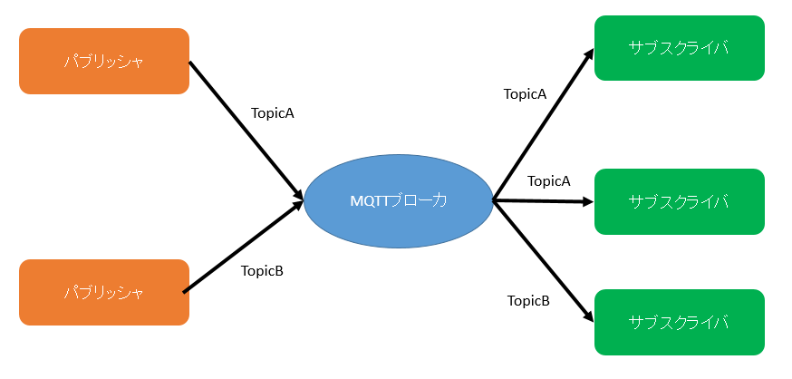
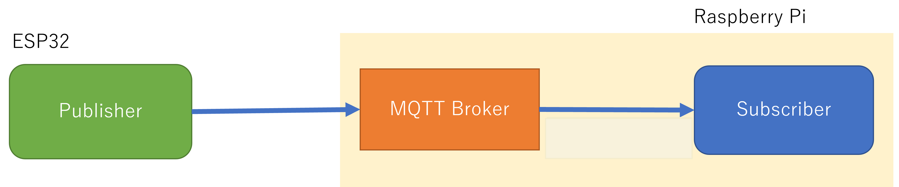
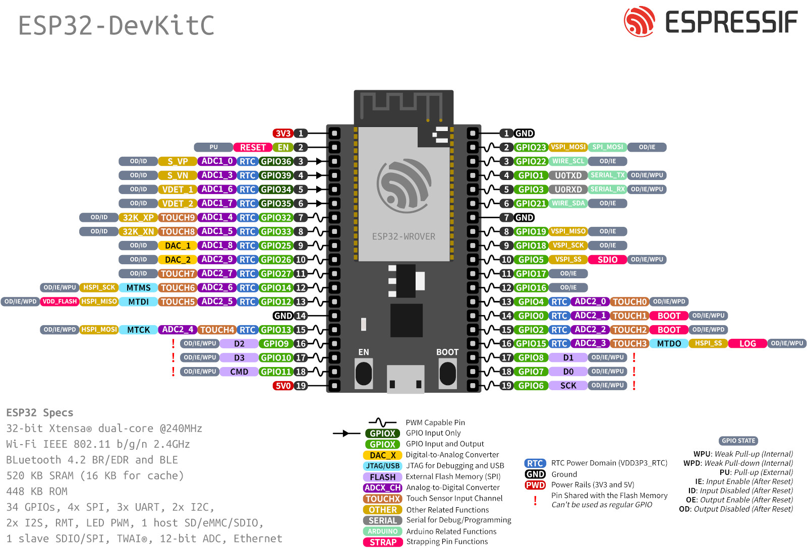
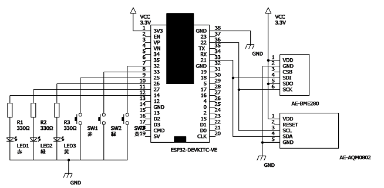
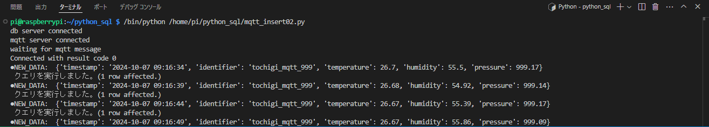

# Raspberry Piを活用したデータ処理とグラフ表示によるIoTシステム構築

## 6. MQTT経由のデータの取得と蓄積

屋内に設置したESP32デバイスからのデータを受信することを考えます。データの取得はMQTTプロトコルを使用します。MQTT通信は、校内に設置したMQTTブローカを利用することを想定しています。

### 6.1 MQTTとは

MQTT(Message Queue Telemetry Transport)とは、「ブローカ」と呼ばれる仲介サーバがネットワーク上に存在し、「パブリッシャ」と呼ばれる送信デバイスと「サブスクライバ」と呼ばれる受信デバイスが複数存在する。パブリッシャから送信されるデータには、「トピック」と呼ばれる区別文字列とデータが含まれている。個々のサブスクライバは、どのトピックを受信するかをブローカに登録し、常時ブローカと接続をしておきます。ブローカは、パブリッシャからデータを受信したら、そのトピックを判定して、そのトピックに登録されているサブスクライバの全てに送信します。これで、サブスクライバは特定のパブリッシャからのデータのみを受信することになる。MQTTのメッセージ構成は簡単で、高速で送受信ができるようになっていて、かつ軽量なので、IoTなどに使われる非力なプロッサでも対応でき、今日よくつかわれようになっています。

<center>
  
</center>

#### 6.1.1 MQTTの通信の仕組み

MQTTの手順で、Wi-Fiなどのネットワーク通信を用いてESP32とPC間の通信を行います。データを送信するデバイスは、ブローカと呼ばれるサーバにデータの種類を示す`topic`などと共に短い送信データを送ります。サーバは、`topic`を指定することで、受信を要望するデバイスにサーバで受信したデータのうち、要求に該当するデータを要求してきたデバイスに送信します。今回はTopicを`esp32/bme`とし，ESP32がpublisherとなりデータの送信を行い、データの取得する。



### 6.2 Mosquittoクライアントからのデータ取得

#### 6.2.1 サブスクライバ側の操作

MQTT通信の接続テストを行います。

* ターミナル１の操作

```bash
pi@raspberrypi:~/python_sql $ sudo apt -y install mosquitto-clients
```

MQTTブローカに接続して、データを取得します。コマンドを入力し、MQTTサブスクライバを起動します。コマンドの書式は、次のとおりです。今回は、実習場内に設置したRaspberryPiをMQTTブローカとして、利用します。接続先サーバには、MQTTブローカとして動作しているRaspberryPiのIPアドレスを設定します。

<code>mosquitto_sub -h 接続先サーバ -p ポート番号 -t トピック名</code>

それぞれのパラメータの意味と設定値は次のとおりです。

| パラメータ | 意味 | 設定例 |
| --- | --- | --- |
| -h | サーバ名 | -h localhost |
| -p | ポート番号 | -p 1883 |
| -t | トピック名 | -t device/tochigi |


```bash
pi@raspberrypi:~/python_sql $ mosquitto_sub -h xx.xx.xx.xx -p 1883 -t test
```

```bash
Client (null) sending CONNECT
Client (null) received CONNACK (0)
Client (null) sending SUBSCRIBE (Mid: 1, Topic: test, QoS: 0, Options: 0x00)
Client (null) received SUBACK
Subscribed (mid: 1): 0
```

#### 6.2.2 パブリッシャ側の操作

新しいターミナルを追加して操作します。

* ターミナル２の操作

MQTTブローカに接続して、データを送信します。コマンドを入力し、MQTTパブリッシャを起動します。コマンドの書式は、次のとおりです。xxの部分は、MQTTブローカのIPアドレスを指定します。

```bash
pi@raspberrypi:~/python_sql $ mosquitto_pub -h xx.xx.xx.xx -p 1883 -t test -m "Hello MQTT!"
```

```bash
Client (null) sending CONNECT
Client (null) received CONNACK (0)
Client (null) sending PUBLISH (d0, q0, r0, m1, 'test', ... (11 bytes))
Client (null) sending DISCONNECT
```

* ターミナル１の操作

サブスクライバ側のターミナルでメッセージが取得できているのがわかります。

```bash
Hello MQTT!
```

### 6.3 ESP32クライアントからのデータ取得

#### 6.3.1 ESP32-DevKitCについて

ESP32-DevKitC-VEはESP-WROOM-32Eを搭載した開発用評価ボードです。手軽にESP32を利用することができ，[ESP32-WROOM-32E](https://www.espressif.com/sites/default/files/documentation/esp32-wroom-32e_esp32-wroom-32ue_datasheet_en.pdf)モジュールには、Wi-FiとBluetoothの通信機能が内蔵されています。開発環境として、Arduino IDEを使う方法、ESP-IDFという専用の開発環境を使用する方法の他に、MicroPythonによる開発が可能です．

#### 6.3.2 [主な特徴](https://docs.espressif.com/projects/esp-idf/en/latest/esp32/hw-reference/esp32/get-started-devkitc.html)

* IEEE 802.11b/g/nに対応（2.4 GHz）
* Bluetooth Classic及びBLE（4.2）に対応（デュアルモード）
* 低消費電力の32 bit デュアルコアMCUを搭載
* 12 bit SAR A/Dコンバータを搭載
* TCP/IPのプロトコルスタックを搭載
* (H)SPI、UART、I2C、I2S、PWM、GPIOなどさまざまなインターフェースを搭載

#### 6.3.3 仕様 (ESP-WROOM-32E)

* SoC：ESP32（Tensilica LX6 デュアルコア、240 MHz）
* Wi-Fi：802.11 b/g/n（HT40）
* Bluetooth：Classic、BLE 4.2（デュアルモード）
* Wi-Fiモード：Station/softAP/SoftAP+station/P2P
* セキュリティ：WPA/WPA2/WPA2-エンタープライズ/WPS
* 暗号化：AES/RSA/ECC/SHA
* SRAM：520 KB
* フラッシュ：4 MB
* 動作電圧：2.2～3.6 V
* 消費電流：平均80 mA
* 動作温度：-40℃～+85°C
* オンチップセンサ：ホールセンサ、温度センサ
* インターフェース
  * GPIO
  * I2C
  * UART
  * SPI
  * モータ用PWM
  * LED用PWM
  * I2S
  * ADC
  * DAC
  * SDカード（SDIO）
  * IR
  * 静電容量式タッチセンサ
  * ローノイズプリアンプ

#### 6.3.4 ピン配置

ピンレイアウトは下図の通りとなる．

<center>
    
</center>

#### 6.3.4 ESP32の環境構築

Arduino IDEでESP32を利用するための環境構築を行います

#### 6.3.5 USBドライバのインストール

Silicon Labs CP210x driverを以下のアドレスよりダウンロードしてインストールします.

* [Windows](https://www.silabs.com/documents/public/software/CP210x_VCP_Windows.zip)
* [macOS](https://www.silabs.com/documents/public/software/Mac_OSX_VCP_Driver.zip)
* [Linux](https://m5stack.oss-cn-shenzhen.aliyuncs.com/resource/drivers/CP210x_VCP_Linux.zip)

<center>
    
</center>

#### 6.3.6 ブレッドボードへの配線

* 温湿度・気圧センサと小型LCD

|信号名|AE-BME280|AE-AQM0802|ESP32 GPIO|
|:-:|:-:|:-:|:-:|
|SCL|SCK|SCL|22|
|SDA|SDI|SDA|21|
|(アドレス選択)|SDO|-|(3.3V)|
|(電源/VDD)|VDD|VDD|(3.3V)|
|(電源/GND)|GND|GND|(GND)|

* LEDとタクトスイッチ

|GPIO|パーツ|
|:-:|:-:|
|14|赤LED|
|27|緑LED|
|26|黄LED|
|25|赤SW|
|33|緑SW|
|32|黄SW|



#### 6.3.7 ESP32ボードマネージャの追加

ツールメニューよりボードマネージャを選択し、`esp32`で検索を行います。検索結果から、`esp32 by Espressif Systems` のパッケージをインストールします。

#### 6.3.8 ESP32デバイスに応じたボードの選択

`ESP32 Dev Module`等、自身が利用するデバイスとCOMXXに合わせてボードを選択します。

#### 6.3.9 利用するライブラリのインストール

`タイマライブラリ`

* Ticker
  * ライブラリ検索で追加
    * [GitHub](https://github.com/sstaub/Ticker)

`BME280センサ(温度・湿度・気圧計測)ライブラリ`

* SparkFun BME280 Arduino Library
  * ライブラリ検索で追加
    * [GitHub](https://github.com/sparkfun/SparkFun_BME280_Arduino_Library)

`ST7032ライブラリ`

* AE-AQM0802
  * ライブラリ検索で追加
    * [GitHub](https://github.com/olkal/LCD_ST7032)

`MQTTプロトコルによる通信用ライブラリ`

* PubSubClient
  * ライブラリ検索で追加
    * https://pubsubclient.knolleary.net/

* ArduinoJson
  * ライブラリ検索で追加
    * https://arduinojson.org

`NTPサーバによる時間取得ライブラリ`

* NTPClient
  * ライブラ検索で追加
    * [GitHub](https://github.com/arduino-libraries/NTPClient)

#### 6.3.10 ESP32をPublisherにして，センサ情報を送信する

以下のコードは，MQTTブローカへBME280センサで取得したデータを送信します．

`esp32_mqtt.ino`

```c++
/* --------------------ヘッダファイルをインクルード-------------------- */
#include <ArduinoJson.h>
#include <SparkFunBME280.h>
#include <LCD_ST7032.h>
#include <Ticker.h>
#include <PubSubClient.h>
#include <WiFi.h>
#include <time.h>
#include <NTPClient.h>
#include <WiFiUdp.h>

/* -------------------------定義分------------------------- */
/* wifi config */
/* 接続先wifiのSSIDとPASSを設定 */
#define WIFI_SSID "ssid"
#define WIFI_PASSWORD "password"

/* MQTT config */
#define MQTT_SERVER "MQTTブローカのIPアドレス"  //例:xx.xx.xx.xx
#define MQTT_PORT 1883
#define MQTT_BUFFER_SIZE 256
#define TOPIC "esp32/bme"
#define DEVICE_ID "esp001"  //デバイスIDは機器ごとにユニーク

/* PIN config */
#define SW1 25
#define SW2 33
#define SW3 32
#define R_LED 14
#define G_LED 27
#define Y_LED 26

/* -----------------------------インスタンス及び変数の作成------------------------------------ */
/* BME280用インスタンス作成 */
BME280 bme;
BME280_SensorMeasurements measurements;

/* ST7032用インスタンス作成 */
LCD_ST7032 lcd;

/* Ticker用インスタンス作成 */
Ticker tickerMeasure;

/* MQTT用インスタンス作成 */
//WiFiClientのクラスからこのプログラムで実際に利用するWiFiClientのオブジェクトをespClientとして作成
WiFiClient espClient;
//Clientからブローカへの通信を行うPublish、ブローカへデータの受信を要求するSubscribeの処理などの、MQTTの通信を行うためのPubsubClientのクラスから実際に処理を行うオブジェクトclientを作成
PubSubClient client(espClient);

/* MQTT Publish用変数 */
//JSONのオブジェクトを時間、温度、湿度、気圧用に4つの項目のため作成
const int message_capacity = JSON_OBJECT_SIZE(4);
//静的にJSONデータを生成するためにメモリを確保
StaticJsonDocument<message_capacity> json_message;
//JSONデータを格納する文字型配列のサイズを256に設定
char message_buffer[MQTT_BUFFER_SIZE];

/* NTPサーバ用インスタンス作成 */
WiFiUDP ntpUDP;                // UDP client
NTPClient timeClient(ntpUDP);  // NTP client

//表示モード用変数
unsigned int mode = 0;

/* ------------------------------各種関数定義------------------------ */
/* WiFiの設定及び接続 */
void WiFi_init(void) {
  //connect wifi
  WiFi.begin(WIFI_SSID, WIFI_PASSWORD);
  while (WiFi.status() != WL_CONNECTED) {
    Serial.println(".");
    delay(100);
  }

  Serial.println("");
  Serial.print("Connected : ");
  Serial.println(WiFi.localIP());
  //sync Time
  configTime(3600L * 9, 0, "ntp.nict.jp", "ntp.jst.mfeed.ad.jp");
}

/* MQTTBrokerへの接続 */
void Mqtt_connect(void) {
  //サーバーへの接続を維持できるように、これを定期的に呼び出す必要がある
  client.loop();

  //MQTT未接続の場合は，再接続
  while (!client.connected()) {
    Serial.println("Mqtt Reconnecting");
    if (client.connect(DEVICE_ID)) {
      Serial.println("Mqtt Connected");
      break;
    }
  }
}

/* MQTTBrokerへのPublish */
void PublishSensorData(void) {
  //センサからデータの取得
  bme.readAllMeasurements(&measurements);

  //シリアルモニタに取得時間とセンサデータを表示
  Serial.println("Timestamp");
  Serial.println(timeClient.getFormattedTime());
  Serial.println("Humidity,Pressure,BME-Temp");
  Serial.print(measurements.humidity, 0);
  Serial.print(",");
  Serial.print(measurements.pressure / 100, 2);
  Serial.print(",");
  Serial.println(measurements.temperature, 2);

  /* ペイロードを作成して送信を行う．*/
  //JSONデータをクリア
  json_message.clear();

  //JSONの項目をキーと値を添えてJSONを作成
  json_message["timestamp"] = timeClient.getFormattedTime();
  json_message["humid"] = measurements.humidity;
  json_message["press"] = measurements.pressure / 100;
  json_message["temp"] = measurements.temperature;

  //json_messageの中のJSONデータをJSON形式の文字列message_bufferとしてシリアライズ化（文字列に変換）
  serializeJson(json_message, message_buffer, sizeof(message_buffer));

  //トピックをesp32/bmeして、JSON形式の文字列をパブリッシュする
  client.publish(TOPIC, message_buffer);
}

/* スイッチの状態確認 */
void Switch_check(void) {
  if (!digitalRead(SW1)) {
    lcd.clear();
    mode = 0;
    delay(50);
  }
  while (!digitalRead(SW1)) {
  }
  if (!digitalRead(SW2)) {
    lcd.clear();
    mode = 1;
    delay(50);
  }
  while (!digitalRead(SW2)) {
  }
  if (!digitalRead(SW3)) {
    lcd.clear();
    mode = 2;
    delay(50);
  }
  while (!digitalRead(SW3)) {
  }
}

/* setup関数 */
void setup() {
  Serial.begin(115200);

  Wire.begin();

  if (bme.beginI2C() == false)  //Begin communication over I2C
  {
    Serial.println("The sensor did not respond. Please check wiring.");
    while (1)
      ;  //Freeze
  }

  //WiFi接続
  WiFi_init();

  //インスタント化したオブジェクトclientの接続先のサーバを、アドレスとポート番号を設定
  client.setServer(MQTT_SERVER, MQTT_PORT);

  //5secごとにセンサデータを取得及びMQTTBrokerへPublish
  tickerMeasure.attach_ms(5000, PublishSensorData);

  //ST7032設定
  lcd.begin();
  lcd.setcontrast(20);

  //ntp設定
  timeClient.begin();               //init NTP
  timeClient.setTimeOffset(32400);  //0= GMT, 3600 = GMT+1, 32400 = GMT+9

  //PIN設定
  pinMode(SW1, INPUT_PULLUP);
  pinMode(SW2, INPUT_PULLUP);
  pinMode(SW3, INPUT_PULLUP);
  pinMode(R_LED, OUTPUT);
  pinMode(G_LED, OUTPUT);
  pinMode(Y_LED, OUTPUT);
}

/* loop関数 */
void loop() {
  Mqtt_connect();       //MQTTBrokerへの接続
  Switch_check();       //タクトSWの状態読取り
  timeClient.update();  //ntp更新

  switch (mode) {
    case 0:
      digitalWrite(R_LED, 1);
      digitalWrite(G_LED, 0);
      digitalWrite(Y_LED, 0);
      lcd.setCursor(0, 0);
      lcd.print("Temp");
      lcd.setCursor(1, 0);
      lcd.print(measurements.temperature);
      break;
    case 1:
      digitalWrite(R_LED, 0);
      digitalWrite(G_LED, 1);
      digitalWrite(Y_LED, 0);
      lcd.setCursor(0, 0);
      lcd.print("Humi");
      lcd.setCursor(1, 0);
      lcd.print(measurements.humidity);
      break;
    case 2:
      digitalWrite(R_LED, 0);
      digitalWrite(G_LED, 0);
      digitalWrite(Y_LED, 1);
      lcd.setCursor(0, 0);
      lcd.print("Press");
      lcd.setCursor(1, 0);
      lcd.print(measurements.pressure / 100);
      break;
    default:
      break;
  }
}
```

サブスクライバ側の取得データを見てみましょう。

実行結果は次のようになります。

```bash
pi@raspberrypi:~/python_sql $ mosquitto_sub -h xx.xx.xx.xx -p 1883 -t esp32/bme
```

```bash
{"timestamp":"19:01:01","humid":47.76269531,"press":1002.090454,"temp":27.37000084}
```

取得データの`{"timestamp":"xx:xx:xx", humid":xxxxx ...}`の部分が、JSONという形式で書かれています。

### 6.4 PythonからのMQTTデータ取得

PythonでMQTTを取扱うには、`paho-mqtt`ライブラリを使用します。このライブラリを使用するには、次のコマンドを使用します

```bash
pi@raspberrypi:~/python_sql $ sudo apt -y install python3-paho-mqtt
```

#### 6.4.1 Pythonでのデータ取得

プログラムのコードは次のようになります。このプログラムは、MQTTブローカより受け取ったデータをそのまま表示します。

`mqtt_get01.py`

```python
#coding: utf-8

#PahoのMQTTライブラリを使用する
import paho.mqtt.client as mqtt

MQTT_HOST = 'MQTTブローカのIPアドレス'
MQTT_PORT = 1883
MQTT_TOPIC = 'esp32/bme'

#サーバからCONNACK応答を受信したときに実行されるコールバック
def on_connect(client, userdata, flags, rc):
  print("Connected with result code "+str(rc))
  #どのtopicにsubscribeするかを決定。
  #再接続のときも、自動的にon_connectが実行される
  mqttClient.subscribe(MQTT_TOPIC, qos=0)

#PUBLISHメッセージをサーバから受信したときのコールバック
def on_message(client, userdata, msg):
  print(msg.topic+" "+str(msg.payload))

mqttClient = mqtt.Client()
mqttClient.on_connect = on_connect
mqttClient.on_message = on_message

#MQTTブローカーに接続する
mqttClient.connect(MQTT_HOST, MQTT_PORT, 120)

#データを待ち受ける
mqttClient.loop_forever()
```

実行結果は次のようになります。センサからのデータが届くと、データが追加されます。

```bash
Connected with result code 0
esp32/bme b'{"timestamp":"19:03:31","humid":49.19726563,"press":1002.027893,"temp":27.29999924}'
esp32/bme b'{"timestamp":"19:03:36","humid":49.13769531,"press":1002.019592,"temp":27.29000092}'
```

#### 6.4.2 日付を付けたデータの取得

Pythonのプログラムで、データを取得した日付を付けて、「データを取得した日時」、「温度」、「湿度」、「気圧」を受信データより取得します。

`mqtt_get02.py`

```python
#coding: utf-8

#MQTTに関するライブラリを使用する
import paho.mqtt.client as mqtt

#JSONに関するライブラリを使用する
import json

#日付・時刻に関するライブラリを使用する
from datetime import datetime as dt 

#MQTTブローカへの接続に必要な情報
MQTT_HOST = 'MQTTブローカのIPアドレス'
MQTT_PORT = 1883
MQTT_TOPIC = 'esp32/bme'
#mqttClientを指すための変数を用意
mqttClient = None

#サーバからCONNACK応答を受信したときに実行されるコールバック
def on_connect(client, userdata, flags, rc):
  global mqttClient
  print("Connected with result code "+str(rc))

  #どのtopicにsubscribeするかを決定。
  #再接続のときも、自動的にon_connectが実行される
  mqttClient.subscribe(MQTT_TOPIC, qos=2)

#PUBLISHメッセージをサーバから受信したときのコールバック
def on_message(client, userdata, msg):
  #受信データはjson形式となっている、これを辞書形式に変更
  json_msg = json.loads(msg.payload)
  print('●recv: ', json_msg)

  #各項目を取り出し
  date_raw = json_msg["timestamp"]
  humi_raw = json_msg["humid"]
  press_raw = json_msg["press"]
  temp_raw = json_msg["temp"]

  #各データを扱いやすい形に変換
  date = str(dt.today().strftime('%Y-%m-%d')) + " " + str(date_raw) #日付と時間を文字列連結
  #小数点第二位で四捨五入
  temp = round(temp_raw, 2)
  humi = round(humi_raw, 2)
  press = round(press_raw, 2)

  #人間が読める形式で表示
  print('受信したデータ: ', 'タイムスタンプ: ', date, '温度: ', temp, '[deg.C] ,',
        '湿度: ', humi, '[%] ,' , '気圧: ', press, '[hPa] .')

def connect():
  global mqttClient
  mqttClient = mqtt.Client()
  mqttClient.on_connect = on_connect
  mqttClient.on_message = on_message

  #MQTTブローカーに接続する
  mqttClient.connect(MQTT_HOST, MQTT_PORT, 120)

  #データを待ち受ける
  mqttClient.loop_forever()

connect()
```

実行結果は次のようになります。

```bash
●recv:  {'timestamp': '14:40:31', 'humid': 47.76269531, 'press': 1000.674377, 'temp': 27.37000084}
受信したデータ:  タイムスタンプ:  2024-09-19 14:40:31 温度:  27.37 [deg.C] , 湿度:  47.76 [%] , 気圧:  1000.67 [hPa] .
●recv:  {'timestamp': '14:40:36', 'humid': 47.7265625, 'press': 1000.674377, 'temp': 27.37000084}
受信したデータ:  タイムスタンプ:  2024-09-19 14:40:36 温度:  27.37 [deg.C] , 湿度:  47.73 [%] , 気圧:  1000.67 [hPa] .
●recv:  {'timestamp': '14:40:41', 'humid': 48.03613281, 'press': 1000.645996, 'temp': 27.37999916}
受信したデータ:  タイムスタンプ:  2024-09-19 14:40:41 温度:  27.38 [deg.C] , 湿度:  48.04 [%] , 気圧:  1000.65 [hPa] .
●recv:  {'timestamp': '14:40:46', 'humid': 47.40722656, 'press': 1000.631104, 'temp': 27.36000061}
受信したデータ:  タイムスタンプ:  2024-09-19 14:40:46 温度:  27.36 [deg.C] , 湿度:  47.41 [%] , 気圧:  1000.63 [hPa] .
●recv:  {'timestamp': '14:40:51', 'humid': 48.06835938```, 'press': 1000.703064, 'temp': 27.35000038}
受信したデータ:  タイムスタンプ:  2024-09-19 14:40:51 温度:  27.35 [deg.C] , 湿度:  48.07 [%] , 気圧:  1000.7 [hPa] .
```

### 6.5 MQTTから取得したデータの蓄積

MQTTブローカに送られたデータは、ブローカ上では蓄積されず、いずれ消えてしまいます。データを永続的に保持し蓄積するためには、ブローカからデータを取得し、保管しておく必要があります。ここでは、MQTTブローカから取得したデータを、MariaDBで保管することを考えます。

#### 6.5.1 データの取得と蓄積
  
前章で作成したDBアクセスのプログラムを利用して、MQTTブローカから取得したデータをMariaDBで蓄積します。前章で作成したDBアクセスのプログラムは、引数に辞書形式の変数を与えます。これと同じ表記でデータを与えればよさそうです。

`mqtt_insert01.py`

```python
# -*- coding: utf-8 -*-

#MQTTに関するライブラリを使用する
import paho.mqtt.client as mqtt

#JSONに関するライブラリを使用する
import json

#日付・時刻に関するライブラリを使用する
from datetime import datetime as dt

#DB関連を取扱う
import db_ambient

#このノードを識別するID
NODE_IDENTIFIER = 'tochigi_mqtt_999'

#MQTTブローカへの接続に必要な情報
MQTT_HOST = 'MQTTブローカのIPアドレス'
MQTT_PORT = 1883
MQTT_TOPIC = 'esp32/bme'
#mqttClient を指すための変数を用意
mqttClient = None

#サーバからCONNACK応答を受信したときに実行されるコールバック
def on_connect(client, userdata, flags, rc):
  global mqttClient
  print("Connected with result code "+str(rc))

  #どのtopicにsubscribeするかを決定。
  #再接続のときも、自動的にon_connectが実行される
  mqttClient.subscribe(MQTT_TOPIC, qos=2)

#PUBLISHメッセージをサーバから受信したときのコールバック
def on_message(client, userdata, msg):
  #受信データは json 形式となっている、これを辞書形式に変更
  json_msg = json.loads(msg.payload)
  print('●new mqtt message arrived: ', json_msg)
  
  #各項目を取り出し
  date_raw = json_msg["timestamp"]
  humi_raw = json_msg["humid"]
  press_raw = json_msg["press"]
  temp_raw = json_msg["temp"]
  
  #各データを扱いやすい形に変換
  date = str(dt.today().strftime('%Y-%m-%d')) + " " + str(date_raw)
  temp = round(temp_raw, 2)
  humi = round(humi_raw, 2)
  press = round(press_raw, 2)

  #DBに渡すための新しいディクショナリ形式にまとめる。
  new_row ={
    "timestamp" : date,
    "identifier" : NODE_IDENTIFIER,
    "temperature" : temp,
    "humidity" : humi,
    "pressure" : press
  };

  #データベースの操作を行う------
  db_result = db_ambient.insert_row(new_row)
  print(' NEW_DATA: ', new_row)
  print(' クエリを実行しました。('+ str(db_result) +' row affected.)')

def mqtt_connect():
  global mqttClient
  mqttClient = mqtt.Client()
  mqttClient.on_connect = on_connect
  mqttClient.on_message = on_message

  #MQTTブローカーに接続する
  mqttClient.connect(MQTT_HOST, MQTT_PORT, 120)
  print('mqtt broker connected')

#データを待ち受ける
def mqtt_loop():
  print('waiting for mqtt message...')
  mqttClient.loop_forever()

def main():
  #DBサーバに接続する
  db_ambient.connect()
  print('db server connected')

  mqtt_connect()
  mqtt_loop()

main()
```

実行結果は次のようになります。

```bash
db server connected
mqtt broker connected
waiting for mqtt message...
Connected with result code 0
●new mqtt message arrived:  {'timestamp': '14:59:51', 'humid': 40.62792969, 'press': 1000.707642, 'temp': 27.38999939}
 NEW_DATA:  {'timestamp': '2024-09-19 14:59:51', 'identifier': 'tochigi_mqtt_999', 'temperature': 27.39, 'humidity': 40.63, 'pressure': 1000.71}
 クエリを実行しました。(1 row affected.)
●new mqtt message arrived:  {'timestamp': '14:59:56', 'humid': 40.67773438, 'press': 1000.759216, 'temp': 27.39999962}
 NEW_DATA:  {'timestamp': '2024-09-19 14:59:56', 'identifier': 'tochigi_mqtt_999', 'temperature': 27.4, 'humidity': 40.68, 'pressure': 1000.76}
 クエリを実行しました。(1 row affected.)
 ```

MariaDBにログインして、追加されたデータを確認しましょう。

```sql
MariaDB [iot_storage]> SELECT * FROM Ambient;
```

```sql
+--------+---------------------+------------------+-------------+----------+----------+
| row_id | timestamp           | identifier       | temperature | humidity | pressure |
+--------+---------------------+------------------+-------------+----------+----------+
|     16 | 2024-09-11 15:46:48 | tochigi_iot_999  |       25.84 |    52.71 |  1001.23 |
|     17 | 2024-09-11 16:00:54 | tochigi_iot_999  |       25.78 |    49.92 |  1001.18 |
|     18 | 2024-09-11 16:01:04 | tochigi_iot_999  |       25.83 |    50.27 |  1001.11 |
|     19 | 2024-09-19 14:59:51 | tochigi_mqtt_999 |       27.39 |    40.63 |  1000.71 |
|     20 | 2024-09-19 14:59:56 | tochigi_mqtt_999 |        27.4 |    40.68 |  1000.76 |
|     21 | 2024-09-19 15:00:01 | tochigi_mqtt_999 |        27.4 |    40.64 |  1000.75 |
|     22 | 2024-09-19 15:00:06 | tochigi_mqtt_999 |       27.35 |     40.7 |  1000.73 |
|     23 | 2024-09-19 15:00:11 | tochigi_mqtt_999 |       27.36 |    40.65 |  1000.75 |
|     24 | 2024-09-19 15:00:16 | tochigi_mqtt_999 |       27.36 |     40.4 |  1000.76 |
+--------+---------------------+------------------+-------------+----------+----------+
53 rows in set (0.001 sec)
```

#### 6.5.2 モジュール化によるプログラム整理

プログラムをいくつかのファイルに分割して整理します。プログラムのほとんどは前回入力したものと同じなので、コードが異なる部分だけを書き換えてあげます。

`mqtt_insert02.py`

```python
#coding: utf-8

#MQTTでデータ取得する
import mqtt_ambient

#DB関連を取扱う
import db_ambient

#このノードを識別するID
NODE_IDENTIFIER = 'tochigi_mqtt_999';

#コールバック関数
#MQTTブローカより新たなデータが来たらこのメソッドが呼ばれる
def on_mqtt_data_arrive(new_data):
  #DBに渡すための新しいディクショナリ形式にまとめる。
  new_row ={
    'timestamp' : new_data['timestamp'],
    'identifier' : NODE_IDENTIFIER,
    'temperature' : new_data['temperature'],
    'humidity' : new_data['humidity'],
    'pressure' : new_data['pressure']
  };

  #データベースの操作を行う------
  db_result = db_ambient.insert_row(new_row)
  print('●NEW_DATA: ', new_row)
  print(' クエリを実行しました。('+ str(db_result) +' row affected.)')

def main():
  #DB サーバに接続する
  db_ambient.connect()
  print('db server connected')

  #MQTTブローカに接続する
  mqtt_ambient.connect()
  print('mqtt server connected')

  #MQTTブローカからデータが到着したときに呼ばれるコールバック関数をセットする
  mqtt_ambient.add_handler_on_mqtt_data_arrive(on_mqtt_data_arrive)

  #MQTTメッセージを待ち受ける
  print('waiting for mqtt message')
  mqtt_ambient.loop()

main()
```

`mqtt_ambient.py`

```python
#coding: utf-8

#MQTTに関するライブラリを使用する
import paho.mqtt.client as mqtt

#JSONに関するライブラリを使用する
import json

#日付・時刻に関するライブラリを使用する
from datetime import datetime as dt 

#DB関連を取扱う
import db_ambient

#このノードを識別するID
NODE_IDENTIFIER = 'tochigi_mqtt_999'

#MQTTブローカへの接続に必要な情報
MQTT_HOST = 'MQTTブローカのIPアドレス'
MQTT_PORT = 1883
MQTT_TOPIC = 'esp32/bme'
#mqttClient を指すための変数を用意
mqttClient = None
#コールバック関数
handler_on_mqtt_data_arrive = None

#サーバからCONNACK応答を受信したときに実行されるコールバック
def on_connect(client, userdata, flags, rc):
  global mqttClient
  print("Connected with result code "+str(rc))

  #どのtopicにsubscribeするかを決定。
  #再接続のときも、自動的にon_connectが実行される
  mqttClient.subscribe(MQTT_TOPIC, qos=2)

#PUBLISHメッセージをMQTTブローカから受信したときのコールバック
def on_message(client, userdata, msg):
  #受信データはjson形式となっている、これを辞書形式に変更
  json_msg = json.loads(msg.payload)

  #各項目を取り出し
  date_raw = json_msg["timestamp"]
  humi_raw = json_msg["humid"]
  press_raw = json_msg["press"]
  temp_raw = json_msg["temp"]
  
  #各データを扱いやすい形に変換
  date = str(dt.today().strftime('%Y-%m-%d')) + " " + str(date_raw) #日付と時間を文字列連結
  #小数点第二位で四捨五入
  temp = round(temp_raw, 2)
  humi = round(humi_raw, 2)
  press = round(press_raw, 2)

  #データをディクショナリ形式にまとめる
  new_data ={
    'timestamp' : date,
    'temperature' : temp,
    'humidity' : humi,
    'pressure' : press
  };

  handler_on_mqtt_data_arrive(new_data)

#MQTTブローカに接続する
def connect():
  global mqttClient
  mqttClient = mqtt.Client()
  mqttClient.on_connect = on_connect
  mqttClient.on_message = on_message

  #MQTTブローカーに接続する
  mqttClient.connect(MQTT_HOST, MQTT_PORT, 120)

#MQTTメッセージが到着したときに実行されるコールバック関数をセットする
def add_handler_on_mqtt_data_arrive(handler):
  global handler_on_mqtt_data_arrive
  handler_on_mqtt_data_arrive = handler

#MQTTメッセージを待ち受ける
def loop():
  mqttClient.loop_forever()
```

実行結果は次のようになります。

```bash
db server connected
mqtt server connected
waiting for mqtt message
Connected with result code 0
●NEW_DATA:  {'timestamp': '2024-09-19 15:27:41', 'identifier': 'tochigi_mqtt_999', 'temperature': 27.37, 'humidity': 45.32, 'pressure': 1000.47}
 クエリを実行しました。(1 row affected.)
●NEW_DATA:  {'timestamp': '2024-09-19 15:27:46', 'identifier': 'tochigi_mqtt_999', 'temperature': 27.38, 'humidity': 45.22, 'pressure': 1000.45}
 クエリを実行しました。(1 row affected.)
```

MariaDB から挿入されたデータを確認しましょう。

```sql
MariaDB [iot_storage]> SELECT * FROM Ambient;
```

```sql
+--------+---------------------+------------------+-------------+----------+----------+
| row_id | timestamp           | identifier       | temperature | humidity | pressure |
+--------+---------------------+------------------+-------------+----------+----------+
|     45 | 2024-09-19 15:02:01 | tochigi_mqtt_999 |       27.37 |    40.38 |  1000.65 |
|     46 | 2024-09-19 15:02:06 | tochigi_mqtt_999 |       27.38 |    40.05 |  1000.69 |
|     47 | 2024-09-19 15:02:11 | tochigi_mqtt_999 |       27.38 |    40.41 |  1000.74 |
|     48 | 2024-09-19 15:02:16 | tochigi_mqtt_999 |       27.37 |    40.02 |  1000.63 |
|     49 | 2024-09-19 15:02:21 | tochigi_mqtt_999 |       27.37 |    40.51 |  1000.66 |
|     50 | 2024-09-19 15:02:26 | tochigi_mqtt_999 |       27.37 |    40.08 |  1000.71 |
|     51 | 2024-09-19 15:27:41 | tochigi_mqtt_999 |       27.37 |    45.32 |  1000.47 |
|     52 | 2024-09-19 15:27:46 | tochigi_mqtt_999 |       27.38 |    45.22 |  1000.45 |
|     53 | 2024-09-19 15:27:51 | tochigi_mqtt_999 |        27.4 |    45.58 |  1000.49 |
|     54 | 2024-09-19 15:27:56 | tochigi_mqtt_999 |       27.43 |    45.97 |  1000.45 |
+--------+---------------------+------------------+-------------+----------+----------+
53 rows in set (0.001 sec)
```

#### 6.5.3 継続的なデータの蓄積

ターミナルをもう一つ起動して、先ほど作成したデータの測定＆蓄積プログラムを実行しましょう。このターミナルは、閉じずにずっとプログラムを実行しておきましょう。「7. データの集計・分析」でデータの分析を行うので、データ数が多いほど役に立ちます。


