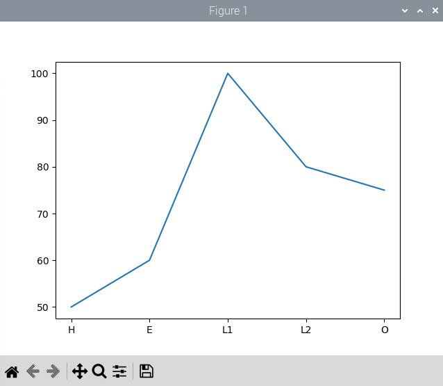

# Raspberry Piを活用したデータ処理とグラフ表示によるIoTシステム構築

## 8. グラフによるデータの可視化

これまでの実習で、温度・湿度・気圧のデータをデータベースに蓄積してきました。IoTにおいて、蓄積したデータは様々な用途で使用することになります。蓄積したデータは、そのままでは役に立ちません。まずは人間の目に見やすいように可視化することが必要です。

可視化することで、いままで気づかなかった傾向に気づけたり、様々な発見につながります。Pythonのライブラリ`matplotlib`を使うと、グラフを描画することができます。本章では、matplotlib によるデータの可視化をおこないます。

下記のコマンドで`matplotlib`をインストールします。

```bash
pi@raspberrypi:~ $ sudo apt -y install python3-matplotlib
```

### 8.1 簡単なグラフの描画

簡単なデータを与えてグラフを描画することを考えます。グラフは２次元の平面グラフとします。X軸とY軸にデータを与えて描画します。グラフに与えるプロットのデータは、`numpy`を利用します。

`graph01.py`

```python
#coding: utf-8

#グラフに関連するモジュール
import matplotlib.pyplot as plt

#配列を取り扱うモジュール
import numpy as np

#配列にプロットするデータを与える
y = np.array([50,60,100,80,75])
x = np.array(["H","E","L1","L2","O"])

#グラフにデータを与える
plt.plot(x,y)

#グラフを表示する
plt.show()
```

RealVNC Viewerを使い、ターミナルから以下のコマンドを実行します。

```bash
pi@raspberrypi:~/python_sql $ /bin/python /home/pi/python_sql/graph01.py
```

次のようなグラフが表示されます。



### 8.2 １時間毎の平均気温のグラフの描画

「7.2 集計したデータの表示」にて１時間毎の平均値を集計し表示するプログラムを作成しました。このプログラムにグラフ描画機能を追加することを考えます。

グラフの描画は前節でプログラムを作成しました。numpy配列にプロットするデータを追加し、matplotlibにそのデータを与えることでグラフを描画できます。その他にも、軸に表示するタイトルなどの設定が必要です。

`bme280_graph_show01.py`

```python
#coding: utf-8

#DB関連をまとめたモジュール
import db_ambient_count01

#グラフ表示関連
import matplotlib.pyplot as plt
import numpy as np

def main():
    #グラフのデータ
    x = np.array([])
    y = np.array([])

    #DBサーバに接続する
    db_ambient_count01.connect()

    #クエリのパラメータを入力
    #表示を開始する日付・時刻を入力する
    print('１時間ごとに平均したデータをグラフにプロットします。')
    print('どのノードのプロットしますか？')
    node_id = input('ノードの Identifier(例: tochigi_iot_999): ')

    print('いつのデータから表示しますか？')
    s_year = input('年(例: 2024): ')
    s_month = input('月(例: 09): ')
    s_day = input('日(例: 11): ')
    s_hour = input('時(例: 00): ')

    datetime_start = f'{s_year}-{s_month}-{s_day} {s_hour}:00:00'

    print(f'{datetime_start}のデータからから何行のデータを表示しますか？')
    #入力したデータを数値に変換
    limit_count = int(input('数値を入力(例: 5) : '))

    #クエリを実施して結果を得る
    result = db_ambient_count01.select_ave_one_hour(node_id, datetime_start, limit_count)


    #クエリの結果得られたデータを表示する
    print( 'timestamp       \t', 'identifier        \t', 'temperature   \t', 'humidity  \t ', 'pressure')
    for data in result:
        print( data['timestamp'], ', \t', data['identifier'], ', \t', data['temperature'], ', \t', data['humidity'], ', \t',data['pressure'])
        x = np.append(x, data['timestamp'])
        y = np.append(y, data['temperature'])

    #グラフの設定を行う
    fig, ax = plt.subplots()

    plt.title('Temperature Trend')      #グラフのタイトルを指定
    plt.xlabel('TimeStamp')             #Y軸のタイトルを指定
    plt.ylabel('Temperature [deg. C.]') #X軸のタイトルを指定

    labels = ax.get_xticklabels()
    plt.setp(labels, rotation=90) #x軸のラベルを90度回転させる

    #plt.ylim(0, 30) #Y軸の範囲を指定
    plt.plot(x,y)    #グラフを描画する

    #グラフを表示する
    plt.show()
main()
```
