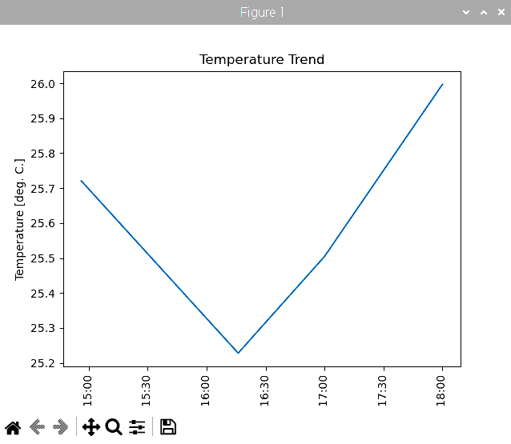

# Raspberry Piを活用したデータ処理とグラフ表示によるIoTシステム構築

## 8. グラフによるデータの可視化

これまでの実習で、温度・湿度・気圧のデータをデータベースに蓄積してきました。IoTにおいて、蓄積したデータは様々な用途で使用することになります。蓄積したデータは、そのままでは役に立ちません。まずは人間の目に見やすいように可視化することが必要です。

可視化することで、いままで気づかなかった傾向に気づけたり、様々な発見につながります。Pythonのライブラリ`matplotlib`を使うと、グラフを描画することができます。本章では、matplotlib によるデータの可視化をおこないます。

下記のコマンドで`matplotlib`をインストールします。

```bash
pi@raspberrypi:~ $ sudo apt -y install python3-matplotlib
```

### 8.1 簡単なグラフの描画

簡単なデータを与えてグラフを描画することを考えます。グラフは２次元の平面グラフとします。X軸とY軸にデータを与えて描画します。グラフに与えるプロットのデータは、`numpy`を利用します。

`graph01.py`

```python
#coding: utf-8

#グラフに関連するモジュール
import matplotlib.pyplot as plt

#配列を取り扱うモジュール
import numpy as np

#配列にプロットするデータを与える
y = np.array([50,60,100,80,75])
x = np.array(["H","E","L1","L2","O"])

#グラフにデータを与える
plt.plot(x,y)

#グラフを表示する
plt.show()
```

`RealVNC Viewer`を使い、ターミナルから以下のコマンドを実行します。

```bash
pi@raspberrypi:~/python_sql $ python graph01.py
```

次のようなグラフが表示されます。


### 8.2 １時間毎の平均気温のグラフの描画

「7.2 集計したデータの表示」にて１時間毎の平均値を集計し表示するプログラムを作成しました。このプログラムにグラフ描画機能を追加することを考えます。

グラフの描画は前節でプログラムを作成しました。numpy配列にプロットするデータを追加し、matplotlibにそのデータを与えることでグラフを描画できます。その他にも、軸に表示するタイトルなどの設定が必要です。

`bme280_graph_show01.py`

```python
#coding: utf-8

#DB関連をまとめたモジュール
import db_ambient_count01

#グラフ表示関連
import matplotlib.pyplot as plt
import numpy as np

def main():
    #グラフのデータ
    x = np.array([])
    y = np.array([])

    #DBサーバに接続する
    db_ambient_count01.connect()

    #クエリのパラメータを入力
    #表示を開始する日付・時刻を入力する
    print('１時間ごとに平均したデータをグラフにプロットします。')
    print('どのノードのプロットしますか？')
    node_id = input('ノードの Identifier(例: tochigi_mqtt_999): ')

    print('いつのデータから表示しますか？')
    s_year = input('年(例: 2024): ')
    s_month = input('月(例: 09): ')
    s_day = input('日(例: 11): ')
    s_hour = input('時(例: 00): ')

    datetime_start = f'{s_year}-{s_month}-{s_day} {s_hour}:00:00'

    print(f'{datetime_start}のデータからから何行のデータを表示しますか？')
    #入力したデータを数値に変換
    limit_count = int(input('数値を入力(例: 5) : '))

    #クエリを実施して結果を得る
    result = db_ambient_count01.select_ave_one_hour(node_id, datetime_start, limit_count)


    #クエリの結果得られたデータを表示する
    print( 'timestamp       \t', 'identifier        \t', 'temperature   \t', 'humidity  \t ', 'pressure')
    for data in result:
        print( data['timestamp'], ', \t', data['identifier'], ', \t', data['temperature'], ', \t', data['humidity'], ', \t',data['pressure'])
        x = np.append(x, data['timestamp'])
        y = np.append(y, data['temperature'])

    #グラフの設定を行う
    fig, ax = plt.subplots()

    plt.title('Temperature Trend')      #グラフのタイトルを指定
    plt.xlabel('TimeStamp')             #Y軸のタイトルを指定
    plt.ylabel('Temperature [deg. C.]') #X軸のタイトルを指定

    labels = ax.get_xticklabels()
    plt.setp(labels, rotation=90) #x軸のラベルを90度回転させる

    #plt.ylim(0, 30) #Y軸の範囲を指定
    plt.plot(x,y)    #グラフを描画する

    #グラフを表示する
    plt.show()

main()
```

`RealVNC Viewer`を使い、ターミナルから以下のコマンドを実行します。

```bash
pi@raspberrypi:~/python_sql $ python bme280_graph_show01.py
```

```bash
１時間ごとに平均したデータをグラフにプロットします。
どのノードのプロットしますか？
ノードの Identifier(例: tochigi_mqtt_999): tochigi_mqtt_999
いつのデータから表示しますか？
年(例: 2024): 2024
月(例: 09): 10
日(例: 11): 01
時(例: 00): 00
2024-10-01 00:00:00のデータからから何行のデータを表示しますか？
数値を入力(例: 5) : 100
timestamp                identifier              temperature     humidity         pressure
2024-10-01 14:56:13 ,    tochigi_mqtt_999 ,      25.720681818181824 ,    57.188636363636355 ,    991.3843181818179
2024-10-01 16:16:03 ,    tochigi_mqtt_999 ,      25.228049242424262 ,    57.34327651515151 ,     990.5278030303031
2024-10-01 17:00:03 ,    tochigi_mqtt_999 ,      25.504888888888868 ,    59.62190277777784 ,     990.2429999999996
2024-10-01 18:00:03 ,    tochigi_mqtt_999 ,      26.034830769230744 ,    59.1392923076923 ,      990.4405230769238
```

次のようなグラフが表示されます。



### 8.3 最新のデータの表示

MariaDBから最新のデータを取得してグラフ化することを考えます。データの取得とグラフ化は前節の方法と同じ方法を用いれば実現できそうです。

`bme280_graph_show02.py`

```python
#coding: utf-8

#DB関連をまとめたモジュール
import db_ambient_count02

#グラフ表示関連
import matplotlib.pyplot as plt
import numpy as np

def main():
    #グラフのデータ
    x = np.array([])
    y = np.array([])

    #DBサーバに接続する
    db_ambient_count02.connect()

    #クエリのパラメータを入力
    #表示を開始する日付・時刻を入力する
    print('最新のデータを表示します。')
    print('どのノードのデータを表示しますか？')
    node_id = input('ノードの Identifier(例:tochigi_mqtt_999): ')

    print('何サンプル前のデータまで表示しますか？')
    #入力したデータを数値に変換
    limit_count = int(input('数値を入力(例: 100) : '))

    #クエリを実施して結果を得る
    result = db_ambient_count02.select_newest(node_id, limit_count)
 
    #クエリの結果得られたデータを表示する
    print( 'timestamp       \t', 'identifier        \t', 'temperature   \t', 'humidity  \t ', 'pressure')
    for data in result:
        print( data['timestamp'], ', \t', data['identifier'], ', \t', data['temperature'], ', \t', data['humidity'], ', \t', data['pressure'])
        x = np.append(x, data['timestamp'])
        y = np.append(y, data['temperature'])
    
    #グラフの設定をおこなう
    fig, ax = plt.subplots()

    plt.title('Temperature Trend')      #グラフのタイトルを指定
    plt.xlabel('TimeStamp')             #Y軸のタイトルを指定
    plt.ylabel('Temperature [deg. C.]') #X軸のタイトルを指定

    labels = ax.get_xticklabels()
    plt.setp(labels, rotation=90) #x軸のラベルを90度回転させる

    plt.plot(x,y)    #グラフを描画する

    #グラフを表示する
    plt.show()

main()
```

`db_ambient_count02.py`

```python
#coding: utf-8

#モジュールをインポート
import pymysql.cursors #PythonからDBを取扱う

#DBへの接続情報
DB_USER = 'iot_user'
DB_PASS = 'password'
DB_HOST = 'localhost'
DB_NAME = 'iot_storage'

#共通で使うオブジェクトを指すための準備
sql_connection = None

def connect():
    global sql_connection

    #DBサーバに接続する
    sql_connection = pymysql.connect(
        user = DB_USER,  #データベースにログインするユーザ名
        passwd = DB_PASS,#データベースユーザのパスワード
        host = DB_HOST,  #接続先DBのホストorIPアドレス
        db = DB_NAME
    )

#データを追加する
def insert_row(row):
    #クエリの作成
    query = "INSERT INTO Ambient(timestamp, identifier, temperature, humidity, pressure) " \
            "VALUES(%(timestamp)s, %(identifier)s, %(temperature)s, %(humidity)s, %(pressure)s);"

    #cursorオブジェクトのインスタンスを生成
    sql_cursor = sql_connection.cursor()

    #クエリを実行する
    result = sql_cursor.execute(query, row)

    #変更を実際に反映させる
    sql_connection.commit()

    return(result)

#１時間毎に平均値を集計する
def select_ave_one_hour(node_id, start_timestamp, limit_count):
    #cursorオブジェクトのインスタンスを生成
    sql_cursor = sql_connection.cursor()
 
    #クエリに渡すパラメータを辞書にまとめる
    param = {
        'target_id' : node_id,
        'target_timestamp' : start_timestamp,
        'target_limit_count' : limit_count
    };

    #クエリのコマンド
    query = 'SELECT timestamp, identifier, AVG(temperature), AVG(humidity) , AVG(pressure) '\
            'FROM Ambient WHERE identifier=%(target_id)s '\
            'AND timestamp >= %(target_timestamp)s '\
            'GROUP BY CONCAT(YEAR(timestamp), MONTH(timestamp), DAY(timestamp), HOUR(timestamp)) '\
            'ORDER BY timestamp ASC '\
            'LIMIT %(target_limit_count)s;'

    #クエリを実行する
    sql_cursor.execute(query, param)

    #クエリを実行した結果得られたデータを辞書にまとめ
    #配列に追加する
    array = []
    for row in sql_cursor.fetchall():
        dict = {
            'timestamp' : row[0],
            'identifier' : row[1],
            'temperature' : row[2],
            'humidity' : row[3],
            'pressure' : row[4]
        }
        array.append(dict)
    #データを格納した辞書の配列を返す
    return(array)

#最新のデータを取得する
#node_id: 対象となるノードのidentifier
#limit_count: 最新のデータから何サンプル取得するか
def select_newest(node_id, limit_count):
    #cursorオブジェクトのインスタンスを生成
    sql_cursor = sql_connection.cursor()

    #クエリに渡すパラメータを辞書にまとめる
    param = {
        'target_id' : node_id,
        'target_limit_count' : limit_count
    };

    #クエリのコマンド
    query = 'SELECT timestamp, identifier, temperature, humidity, pressure '\
            'FROM Ambient WHERE identifier=%(target_id)s '\
            'ORDER BY timestamp DESC '\
            'LIMIT %(target_limit_count)s;'

    #クエリを実行する
    sql_cursor.execute(query, param)

    #クエリを実行した結果得られたデータを辞書にまとめ
    #配列に追加する
    array = []
    for row in sql_cursor.fetchall():
        dict = {
            'timestamp' : row[0],
            'identifier' : row[1],
            'temperature' : row[2],
            'humidity' : row[3],
            'pressure' : row[4]
        }
        array.append(dict)
    #データを格納した辞書の配列を返す
    return(array)
```

`RealVNC Viewer`を使い、ターミナルから以下のコマンドを実行します。

```bash
pi@raspberrypi:~/python_sql $ python bme280_graph_show02.py
```

```bash
最新のデータを表示します。
どのノードのデータを表示しますか？
ノードの Identifier(例:tochigi_mqtt_999): tochigi_mqtt_999
何サンプル前のデータまで表示しますか？
数値を入力(例: 100) : 100
timestamp                identifier              temperature     humidity         pressure
2024-10-01 18:27:02 ,    tochigi_mqtt_999 ,      26.27 ,         58.84 ,         990.52
2024-10-01 18:26:57 ,    tochigi_mqtt_999 ,      26.26 ,         58.63 ,         990.55
2024-10-01 18:26:52 ,    tochigi_mqtt_999 ,      26.26 ,         58.74 ,         990.55
2024-10-01 18:26:47 ,    tochigi_mqtt_999 ,      26.23 ,         58.77 ,         990.59
2024-10-01 18:26:42 ,    tochigi_mqtt_999 ,      26.23 ,         58.57 ,         990.55
2024-10-01 18:26:37 ,    tochigi_mqtt_999 ,      26.22 ,         58.46 ,         990.51
2024-10-01 18:26:32 ,    tochigi_mqtt_999 ,      26.22 ,         58.64 ,         990.54
2024-10-01 18:26:27 ,    tochigi_mqtt_999 ,      26.21 ,         58.38 ,         990.56
2024-10-01 18:26:22 ,    tochigi_mqtt_999 ,      26.2 ,          58.39 ,         990.54
2024-10-01 18:26:17 ,    tochigi_mqtt_999 ,      26.18 ,         58.62 ,         990.51
2024-10-01 18:26:12 ,    tochigi_mqtt_999 ,      26.17 ,         58.16 ,         990.5
2024-10-01 18:26:07 ,    tochigi_mqtt_999 ,      26.17 ,         58.74 ,         990.52
2024-10-01 18:26:02 ,    tochigi_mqtt_999 ,      26.19 ,         58.36 ,         990.52
2024-10-01 18:25:57 ,    tochigi_mqtt_999 ,      26.21 ,         58.28 ,         990.6
2024-10-01 18:25:52 ,    tochigi_mqtt_999 ,      26.22 ,         58.94 ,         990.51
2024-10-01 18:25:47 ,    tochigi_mqtt_999 ,      26.21 ,         59.07 ,         990.56
2024-10-01 18:25:42 ,    tochigi_mqtt_999 ,      26.23 ,         58.67 ,         990.53
2024-10-01 18:25:37 ,    tochigi_mqtt_999 ,      26.23 ,         58.9 ,          990.58
2024-10-01 18:25:32 ,    tochigi_mqtt_999 ,      26.23 ,         58.56 ,         990.55
2024-10-01 18:25:27 ,    tochigi_mqtt_999 ,      26.23 ,         59.07 ,         990.55
2024-10-01 18:25:22 ,    tochigi_mqtt_999 ,      26.22 ,         58.62 ,         990.57
2024-10-01 18:25:17 ,    tochigi_mqtt_999 ,      26.23 ,         58.98 ,         990.5
2024-10-01 18:25:12 ,    tochigi_mqtt_999 ,      26.23 ,         58.76 ,         990.48
2024-10-01 18:25:07 ,    tochigi_mqtt_999 ,      26.23 ,         58.73 ,         990.5
2024-10-01 18:25:02 ,    tochigi_mqtt_999 ,      26.22 ,         58.65 ,         990.52
2024-10-01 18:24:57 ,    tochigi_mqtt_999 ,      26.22 ,         58.98 ,         990.51
2024-10-01 18:24:52 ,    tochigi_mqtt_999 ,      26.21 ,         58.96 ,         990.49
2024-10-01 18:24:47 ,    tochigi_mqtt_999 ,      26.19 ,         58.75 ,         990.53
2024-10-01 18:24:42 ,    tochigi_mqtt_999 ,      26.18 ,         58.62 ,         990.49
2024-10-01 18:24:37 ,    tochigi_mqtt_999 ,      26.17 ,         58.68 ,         990.6
2024-10-01 18:24:32 ,    tochigi_mqtt_999 ,      26.16 ,         58.75 ,         990.48
2024-10-01 18:24:27 ,    tochigi_mqtt_999 ,      26.16 ,         58.63 ,         990.58
2024-10-01 18:24:22 ,    tochigi_mqtt_999 ,      26.17 ,         58.5 ,          990.52
2024-10-01 18:24:17 ,    tochigi_mqtt_999 ,      26.17 ,         58.67 ,         990.52
2024-10-01 18:24:12 ,    tochigi_mqtt_999 ,      26.17 ,         58.68 ,         990.52
2024-10-01 18:24:07 ,    tochigi_mqtt_999 ,      26.18 ,         58.84 ,         990.48
2024-10-01 18:24:02 ,    tochigi_mqtt_999 ,      26.18 ,         58.53 ,         990.51
2024-10-01 18:23:57 ,    tochigi_mqtt_999 ,      26.17 ,         58.8 ,          990.5
2024-10-01 18:23:52 ,    tochigi_mqtt_999 ,      26.17 ,         59.01 ,         990.5
2024-10-01 18:23:47 ,    tochigi_mqtt_999 ,      26.17 ,         58.9 ,          990.46
2024-10-01 18:23:42 ,    tochigi_mqtt_999 ,      26.15 ,         58.38 ,         990.47
2024-10-01 18:23:37 ,    tochigi_mqtt_999 ,      26.16 ,         58.98 ,         990.48
2024-10-01 18:23:32 ,    tochigi_mqtt_999 ,      26.17 ,         58.46 ,         990.52
2024-10-01 18:23:27 ,    tochigi_mqtt_999 ,      26.18 ,         58.74 ,         990.51
2024-10-01 18:23:22 ,    tochigi_mqtt_999 ,      26.19 ,         58.8 ,          990.48
2024-10-01 18:23:17 ,    tochigi_mqtt_999 ,      26.18 ,         58.83 ,         990.54
2024-10-01 18:23:12 ,    tochigi_mqtt_999 ,      26.18 ,         58.7 ,          990.51
2024-10-01 18:23:07 ,    tochigi_mqtt_999 ,      26.17 ,         58.94 ,         990.46
2024-10-01 18:23:02 ,    tochigi_mqtt_999 ,      26.17 ,         58.97 ,         990.5
2024-10-01 18:22:57 ,    tochigi_mqtt_999 ,      26.16 ,         59.16 ,         990.56
2024-10-01 18:22:52 ,    tochigi_mqtt_999 ,      26.17 ,         58.59 ,         990.52
2024-10-01 18:22:47 ,    tochigi_mqtt_999 ,      26.16 ,         58.56 ,         990.53
2024-10-01 18:22:42 ,    tochigi_mqtt_999 ,      26.16 ,         58.53 ,         990.56
2024-10-01 18:22:37 ,    tochigi_mqtt_999 ,      26.14 ,         58.88 ,         990.53
2024-10-01 18:22:32 ,    tochigi_mqtt_999 ,      26.16 ,         58.5 ,          990.47
2024-10-01 18:22:27 ,    tochigi_mqtt_999 ,      26.14 ,         58.79 ,         990.4
2024-10-01 18:22:22 ,    tochigi_mqtt_999 ,      26.15 ,         58.67 ,         990.47
2024-10-01 18:22:17 ,    tochigi_mqtt_999 ,      26.16 ,         58.33 ,         990.48
2024-10-01 18:22:12 ,    tochigi_mqtt_999 ,      26.15 ,         58.97 ,         990.55
2024-10-01 18:22:07 ,    tochigi_mqtt_999 ,      26.15 ,         58.49 ,         990.54
2024-10-01 18:22:02 ,    tochigi_mqtt_999 ,      26.15 ,         58.68 ,         990.49
2024-10-01 18:21:57 ,    tochigi_mqtt_999 ,      26.13 ,         58.75 ,         990.51
2024-10-01 18:21:52 ,    tochigi_mqtt_999 ,      26.15 ,         59.1 ,          990.49
2024-10-01 18:21:47 ,    tochigi_mqtt_999 ,      26.13 ,         58.91 ,         990.49
2024-10-01 18:21:42 ,    tochigi_mqtt_999 ,      26.13 ,         58.78 ,         990.42
2024-10-01 18:21:37 ,    tochigi_mqtt_999 ,      26.12 ,         58.8 ,          990.51
2024-10-01 18:21:32 ,    tochigi_mqtt_999 ,      26.1 ,          58.71 ,         990.49
2024-10-01 18:21:27 ,    tochigi_mqtt_999 ,      26.11 ,         58.87 ,         990.52
2024-10-01 18:21:22 ,    tochigi_mqtt_999 ,      26.12 ,         58.9 ,          990.43
2024-10-01 18:21:17 ,    tochigi_mqtt_999 ,      26.11 ,         59.04 ,         990.47
2024-10-01 18:21:12 ,    tochigi_mqtt_999 ,      26.1 ,          59.12 ,         990.46
2024-10-01 18:21:07 ,    tochigi_mqtt_999 ,      26.09 ,         58.74 ,         990.44
2024-10-01 18:21:02 ,    tochigi_mqtt_999 ,      26.11 ,         58.67 ,         990.5
2024-10-01 18:20:57 ,    tochigi_mqtt_999 ,      26.11 ,         58.83 ,         990.48
2024-10-01 18:20:52 ,    tochigi_mqtt_999 ,      26.1 ,          58.8 ,          990.38
2024-10-01 18:20:47 ,    tochigi_mqtt_999 ,      26.11 ,         58.78 ,         990.51
2024-10-01 18:20:42 ,    tochigi_mqtt_999 ,      26.1 ,          58.55 ,         990.46
2024-10-01 18:20:37 ,    tochigi_mqtt_999 ,      26.1 ,          59.12 ,         990.44
2024-10-01 18:20:32 ,    tochigi_mqtt_999 ,      26.1 ,          58.82 ,         990.44
2024-10-01 18:20:27 ,    tochigi_mqtt_999 ,      26.08 ,         58.61 ,         990.45
2024-10-01 18:20:22 ,    tochigi_mqtt_999 ,      26.09 ,         59.39 ,         990.42
2024-10-01 18:20:17 ,    tochigi_mqtt_999 ,      26.09 ,         59.02 ,         990.53
2024-10-01 18:20:12 ,    tochigi_mqtt_999 ,      26.09 ,         59.13 ,         990.42
2024-10-01 18:20:07 ,    tochigi_mqtt_999 ,      26.1 ,          59.14 ,         990.49
2024-10-01 18:20:02 ,    tochigi_mqtt_999 ,      26.11 ,         58.74 ,         990.48
2024-10-01 18:19:57 ,    tochigi_mqtt_999 ,      26.1 ,          58.54 ,         990.49
2024-10-01 18:19:52 ,    tochigi_mqtt_999 ,      26.07 ,         58.88 ,         990.47
2024-10-01 18:19:47 ,    tochigi_mqtt_999 ,      26.09 ,         58.82 ,         990.47
2024-10-01 18:19:42 ,    tochigi_mqtt_999 ,      26.12 ,         59.08 ,         990.51
2024-10-01 18:19:37 ,    tochigi_mqtt_999 ,      26.11 ,         58.72 ,         990.45
2024-10-01 18:19:32 ,    tochigi_mqtt_999 ,      26.11 ,         59.09 ,         990.5
2024-10-01 18:19:27 ,    tochigi_mqtt_999 ,      26.1 ,          58.67 ,         990.43
2024-10-01 18:19:22 ,    tochigi_mqtt_999 ,      26.11 ,         59.09 ,         990.5
2024-10-01 18:19:17 ,    tochigi_mqtt_999 ,      26.09 ,         59.01 ,         990.47
2024-10-01 18:19:12 ,    tochigi_mqtt_999 ,      26.09 ,         59.08 ,         990.52
2024-10-01 18:19:07 ,    tochigi_mqtt_999 ,      26.07 ,         58.91 ,         990.44
2024-10-01 18:19:02 ,    tochigi_mqtt_999 ,      26.08 ,         59.2 ,          990.45
2024-10-01 18:18:57 ,    tochigi_mqtt_999 ,      26.06 ,         59.3 ,          990.4
2024-10-01 18:18:52 ,    tochigi_mqtt_999 ,      26.05 ,         59.03 ,         990.46
2024-10-01 18:18:47 ,    tochigi_mqtt_999 ,      26.03 ,         59.13 ,         990.43
```

次のようなグラフが表示されます。


### 8.4 リアルタイムな温度のグラフの描画（温度のみ）

最新の測定データをグラフ化し、常に最新のデータを画面に表示することを考えます。過去の数値の変化をグラフで視認することにより、直近のデータの変化の傾向を直感的に把握することができます。

データの更新周期ごとに最新の測定データをMariaDBより取得して、matplotlibにより描画します。

`bme280_graph_realtime01.py`

```python
#coding: utf-8

#DB関連をまとめたモジュール
import db_ambient_count02

#グラフ表示関連
import sys
import matplotlib.pyplot as plt
import math
import numpy as np

def main():
    #グラフのデータ(空のデータを準備)
    x = np.array([])
    y = np.array([])

    #クエリのパラメータを入力
    #表示を開始する日付・時刻を入力する
    print('最新のデータをリアルタイムに表示します。')
    print('どのノードのデータを表示しますか？')
    node_id = input('ノードの Identifier(例: tochigi_iot_999): ')

    print('何サンプル前のデータまで表示しますか？')
    #入力したデータを数値に変換
    limit_count = int(input('数値を入力(例: 20) : '))

    print('グラフの更新周期(秒)は？')
    #入力したデータを数値に変換
    update_cycle = int(input('数値を入力(例: 10) : '))

    #グラフの設定
    fig, ax = plt.subplots()

    #グラフのタイトルを指定
    plt.title(f'Temperature Trend(Node: {node_id}, Every {update_cycle} sec. cycle)')
    plt.xlabel('TimeStamp')             #Y軸のタイトルを指定
    plt.ylabel('Temperature [deg. C.]') #X軸のタイトルを指定

    #ラベルの設定
    labels = ax.get_xticklabels()
    plt.setp(labels, rotation=90) #x軸のラベルを90度回転させる

    while True:
        #DBサーバに接続する
        db_ambient_count02.connect()

        #グラフに与えるデータを初期化
        x = np.array([])
        y = np.array([])

        #グラフ内のデータを初期化
        plt.clf()

        #クエリを実施して結果を得る
        result = db_ambient_count02.select_newest(node_id, limit_count)

        #クエリの結果得られたデータを表示する
        print( 'timestamp       \t', 'identifier        \t', 'temperature   \t', 'humidity  \t ','pressure')

        for data in result:
            print( data['timestamp'], ', \t', data['identifier'], ', \t', data['temperature'], ', \t', data['humidity'], ', \t', data['pressure'])
            #得られたデータをプロットとして追加する
            x = np.append(x, data['timestamp'])
            y = np.append(y, data['temperature'])
 
        plt.plot(x,y) #グラフを描画する

        #次の更新周期まで待つ
        plt.pause(update_cycle)

main()
```

まずはVSCodeで`SSH`を使い、ターミナルから以下のコマンドを実行し、RaspberyPiに接続されたBME280のセンサデータをデータベースに定期的に蓄積させ続けます。

```bash
pi@raspberrypi:~/python_sql $ python bme280_insert_cyclic02.py
```

次に`RealVNC Viewer`を使い、ターミナルから以下のコマンドを実行します。

```bash
pi@raspberrypi:~/python_sql $ python bme280_graph_realtime01.py
```

実行結果は次のようになります。

```bash
最新のデータをリアルタイムに表示します。
どのノードのデータを表示しますか？
ノードの Identifier(例: tochigi_iot_999): tochigi_iot_999
何サンプル前のデータまで表示しますか？
数値を入力(例: 20) : 20
グラフの更新周期(秒)は？
数値を入力(例: 10) : 10
timestamp                identifier              temperature     humidity         pressure
2024-10-04 16:32:09 ,    tochigi_iot_999 ,       28.83 ,         48.93 ,         1002.64
2024-10-04 16:31:59 ,    tochigi_iot_999 ,       28.84 ,         48.93 ,         1002.61
2024-10-04 16:31:49 ,    tochigi_iot_999 ,       28.82 ,         48.97 ,         1002.65
2024-10-04 16:31:38 ,    tochigi_iot_999 ,       28.84 ,         48.94 ,         1002.61
2024-10-04 16:31:28 ,    tochigi_iot_999 ,       28.84 ,         48.92 ,         1002.67
2024-10-04 16:31:18 ,    tochigi_iot_999 ,       28.83 ,         48.94 ,         1002.6
2024-10-04 16:31:08 ,    tochigi_iot_999 ,       28.83 ,         48.91 ,         1002.6
2024-10-04 16:30:58 ,    tochigi_iot_999 ,       28.83 ,         48.94 ,         1002.6
2024-10-04 16:30:48 ,    tochigi_iot_999 ,       28.83 ,         48.96 ,         1002.57
2024-10-04 16:30:38 ,    tochigi_iot_999 ,       28.83 ,         48.93 ,         1002.58
2024-10-04 16:30:28 ,    tochigi_iot_999 ,       28.83 ,         48.95 ,         1002.61
2024-10-04 16:30:17 ,    tochigi_iot_999 ,       28.84 ,         48.96 ,         1002.57
2024-10-04 16:30:07 ,    tochigi_iot_999 ,       28.84 ,         48.91 ,         1002.56
2024-10-04 16:29:57 ,    tochigi_iot_999 ,       28.85 ,         48.87 ,         1002.63
2024-10-04 16:29:47 ,    tochigi_iot_999 ,       28.85 ,         48.88 ,         1002.58
2024-10-04 16:29:37 ,    tochigi_iot_999 ,       28.84 ,         48.94 ,         1002.59
2024-10-04 16:29:27 ,    tochigi_iot_999 ,       28.82 ,         48.95 ,         1002.53
2024-10-04 16:29:17 ,    tochigi_iot_999 ,       28.82 ,         48.95 ,         1002.51
2024-10-04 16:29:07 ,    tochigi_iot_999 ,       28.83 ,         48.93 ,         1002.54
2024-10-04 16:28:57 ,    tochigi_iot_999 ,       28.83 ,         48.93 ,         1002.57
```

次のようなグラフが表示されます。


しばらく時間が経つと、次のようにグラフが進んで表示されます。


グラフはリアルタイムに更新されるので、新しいデータが右側に追加されます。古いデータは左側にずれて表示されます。

### 8.5 温度・湿度・気圧を同時に表示する

取得しているデータは「温度」「湿度」「気圧」の３種類です。これらのグラフをすべて一つの画面に表示すると、それぞれのデータとの関連性を把握しやすくなります。ここでは、複数のグラフを並べて表示する方法を考えます。

グラフ全体の大きさを設定したあと、グラフの描画エリアを３つぶん定義し、それぞれのエリアにグラフを描画することとして考えます。今回は、横に３つ並ぶグラフとして設定します。

`bme280_graph_show_multi01.py`

```python
#coding: utf-8

#DB関連をまとめたモジュール
import db_ambient_count02

#グラフ表示関連
import matplotlib.pyplot as plt
import numpy as np

def main():
    #グラフのデータ
    x = np.array([])
    y={
        'temperature' : np.array([]),
        'humidity' : np.array([]),
        'pressure' : np.array([])
    }

    #DBサーバに接続する
    db_ambient_count02.connect()

    #クエリのパラメータを入力
    #表示を開始する日付・時刻を入力する
    print('最新のデータを表示します。')
    print('どのノードのデータを表示しますか？')

    node_id = input('ノードの Identifier(例: tochigi_mqtt_999): ')

    print('何サンプル前のデータまで表示しますか？')
    #入力したデータを数値に変換
    limit_count = int(input('数値を入力(例: 100) : '))

    #クエリを実施して結果を得る
    result = db_ambient_count02.select_newest(node_id, limit_count)

    #クエリの結果得られたデータを表示する
    print( 'timestamp       \t', 'identifier        \t', 'temperature   \t', 'humidity  \t ','pressure')
    for data in result:
        print( data['timestamp'], ', \t', data['identifier'], ', \t', data['temperature'], ', \t', data['humidity'], ', \t', data['pressure'])
        x = np.append(x, data['timestamp'])
        y['temperature'] = np.append(y['temperature'], data['temperature'])
        y['humidity'] = np.append(y['humidity'], data['humidity'])
        y['pressure'] = np.append(y['pressure'], data['pressure'])

    #グラフの設定をおこなう
    plt.rcParams["figure.figsize"] = (15,5) #グラフの大きさを指定する
    plt.tight_layout()                      #文字が重ならないようなレイアウトにする

    #１つめのグラフを用意する
    plt.subplot(1,3,1)                  #縦1-横3のエリアを設定し、その１つめのグラフ
    plt.title('Temperature Trend')      #グラフのタイトルを指定
    plt.xlabel('TimeStamp')             #Y軸のタイトルを指定
    plt.ylabel('Temperature [deg. C.]') #X軸のタイトルを指定
    plt.xticks(rotation=45)             #X軸のラベルを45°回転させる
    
    #上下左右の余白の設定
    plt.subplots_adjust(left=0.1, right=0.9, bottom=0.2, top=0.95)
    plt.plot(x, y['temperature']) #プロットデータを設定する

    #２つめのグラフを用意する
    plt.subplot(1,3,2)                  #縦１-横３のエリアを設定し、その２つめのグラフ
    plt.title('Humidity Trend')         #グラフのタイトルを指定
    plt.xlabel('TimeStamp')             #Y軸のタイトルを指定
    plt.ylabel('Humidity [%]')          #X軸のタイトルを指定
    plt.xticks(rotation=45)             #X軸のラベルを45°回転させる
    
    #上下左右の余白の設定
    plt.subplots_adjust(left=0.1, right=0.9, bottom=0.2, top=0.95)
    plt.plot(x, y['humidity'])#プロットデータを設定す

    #３つめのグラフを用意する
    plt.subplot(1,3,3)                  #縦１-横３のエリアを設定し、その３つめのグラフ
    plt.ylim(995, 1035)                 #Y軸の値の範囲を設定
    plt.title('Pressure Trend')         #グラフのタイトルを指定
    plt.xlabel('TimeStamp')             #Y軸のタイトルを指定
    plt.ylabel('Pressure [hPa]')        #X軸のタイトルを指定
    plt.xticks(rotation=45)             #X軸のラベルを45°回転させる
    
    #上下左右の余白の設定
    plt.subplots_adjust(left=0.1, right=0.9, bottom=0.2, top=0.95)
    plt.plot(x, y['pressure'])#プロットデータを設定する

    plt.show() #グラフ全体をを表示する

main()
```

`RealVNC Viewer`を使い、ターミナルから以下のコマンドを実行します。

```bash
pi@raspberrypi:~/python_sql $ python bme280_graph_show_multi01.py
```

実行結果は次のようになります。

```bash
最新のデータを表示します。
どのノードのデータを表示しますか？
ノードの Identifier(例: tochigi_mqtt_999): tochigi_mqtt_999
何サンプル前のデータまで表示しますか？
数値を入力(例: 100) : 100
timestamp                identifier              temperature     humidity         pressure
2024-10-04 09:37:19 ,    tochigi_mqtt_999 ,      27.48 ,         49.43 ,         1004.89
2024-10-04 09:37:14 ,    tochigi_mqtt_999 ,      27.49 ,         49.11 ,         1004.84
2024-10-04 09:37:09 ,    tochigi_mqtt_999 ,      27.48 ,         49.11 ,         1004.82
2024-10-04 09:37:04 ,    tochigi_mqtt_999 ,      27.48 ,         49.04 ,         1004.84
2024-10-04 09:36:59 ,    tochigi_mqtt_999 ,      27.48 ,         49.19 ,         1004.81
2024-10-04 09:36:54 ,    tochigi_mqtt_999 ,      27.48 ,         49.23 ,         1004.87
2024-10-04 09:36:49 ,    tochigi_mqtt_999 ,      27.48 ,         49.11 ,         1004.81
2024-10-04 09:36:44 ,    tochigi_mqtt_999 ,      27.46 ,         49.11 ,         1004.81
2024-10-04 09:36:39 ,    tochigi_mqtt_999 ,      27.45 ,         49.46 ,         1004.82
2024-10-04 09:36:34 ,    tochigi_mqtt_999 ,      27.44 ,         49.53 ,         1004.83
2024-10-04 09:36:29 ,    tochigi_mqtt_999 ,      27.45 ,         49.12 ,         1004.88
2024-10-04 09:36:24 ,    tochigi_mqtt_999 ,      27.43 ,         49.52 ,         1004.89
2024-10-04 09:36:19 ,    tochigi_mqtt_999 ,      27.41 ,         48.98 ,         1004.84
2024-10-04 09:36:14 ,    tochigi_mqtt_999 ,      27.42 ,         49.47 ,         1004.79
2024-10-04 09:36:09 ,    tochigi_mqtt_999 ,      27.42 ,         49.12 ,         1004.85
2024-10-04 09:36:04 ,    tochigi_mqtt_999 ,      27.42 ,         49.57 ,         1004.8
2024-10-04 09:35:59 ,    tochigi_mqtt_999 ,      27.43 ,         49.35 ,         1004.86
2024-10-04 09:35:54 ,    tochigi_mqtt_999 ,      27.44 ,         49.19 ,         1004.83
2024-10-04 09:35:49 ,    tochigi_mqtt_999 ,      27.45 ,         49.46 ,         1004.8
2024-10-04 09:35:44 ,    tochigi_mqtt_999 ,      27.45 ,         49.67 ,         1004.84
2024-10-04 09:35:39 ,    tochigi_mqtt_999 ,      27.45 ,         49.86 ,         1004.9
2024-10-04 09:35:34 ,    tochigi_mqtt_999 ,      27.44 ,         49.74 ,         1004.88
2024-10-04 09:35:29 ,    tochigi_mqtt_999 ,      27.43 ,         49.48 ,         1004.92
2024-10-04 09:35:24 ,    tochigi_mqtt_999 ,      27.43 ,         49.55 ,         1004.81
2024-10-04 09:35:19 ,    tochigi_mqtt_999 ,      27.43 ,         48.93 ,         1004.82
2024-10-04 09:35:14 ,    tochigi_mqtt_999 ,      27.44 ,         49.65 ,         1004.94
2024-10-04 09:35:09 ,    tochigi_mqtt_999 ,      27.45 ,         49.59 ,         1004.92
2024-10-04 09:35:04 ,    tochigi_mqtt_999 ,      27.45 ,         49.49 ,         1004.85
2024-10-04 09:34:59 ,    tochigi_mqtt_999 ,      27.45 ,         49.16 ,         1004.92
2024-10-04 09:34:54 ,    tochigi_mqtt_999 ,      27.44 ,         49.58 ,         1004.88
2024-10-04 09:34:49 ,    tochigi_mqtt_999 ,      27.43 ,         49.37 ,         1004.81
2024-10-04 09:34:44 ,    tochigi_mqtt_999 ,      27.43 ,         49.14 ,         1004.79
2024-10-04 09:34:39 ,    tochigi_mqtt_999 ,      27.44 ,         49.46 ,         1004.94
2024-10-04 09:34:34 ,    tochigi_mqtt_999 ,      27.43 ,         49.44 ,         1004.92
2024-10-04 09:34:29 ,    tochigi_mqtt_999 ,      27.41 ,         49.38 ,         1004.89
2024-10-04 09:34:24 ,    tochigi_mqtt_999 ,      27.4 ,          49.89 ,         1004.92
2024-10-04 09:34:19 ,    tochigi_mqtt_999 ,      27.36 ,         49.36 ,         1004.91
2024-10-04 09:34:14 ,    tochigi_mqtt_999 ,      27.37 ,         49.74 ,         1004.9
2024-10-04 09:34:09 ,    tochigi_mqtt_999 ,      27.36 ,         49.18 ,         1004.91
2024-10-04 09:34:04 ,    tochigi_mqtt_999 ,      27.36 ,         49.57 ,         1004.91
2024-10-04 09:33:59 ,    tochigi_mqtt_999 ,      27.36 ,         49.09 ,         1004.91
2024-10-04 09:33:54 ,    tochigi_mqtt_999 ,      27.37 ,         49.65 ,         1004.88
2024-10-04 09:33:49 ,    tochigi_mqtt_999 ,      27.38 ,         49.63 ,         1004.89
2024-10-04 09:33:44 ,    tochigi_mqtt_999 ,      27.37 ,         49.84 ,         1004.9
2024-10-04 09:33:39 ,    tochigi_mqtt_999 ,      27.36 ,         49.42 ,         1004.96
2024-10-04 09:33:34 ,    tochigi_mqtt_999 ,      27.35 ,         49.24 ,         1004.87
2024-10-04 09:33:29 ,    tochigi_mqtt_999 ,      27.34 ,         49.13 ,         1004.87
2024-10-04 09:33:24 ,    tochigi_mqtt_999 ,      27.35 ,         49.27 ,         1004.92
2024-10-04 09:33:19 ,    tochigi_mqtt_999 ,      27.34 ,         48.71 ,         1004.9
2024-10-04 09:33:14 ,    tochigi_mqtt_999 ,      27.33 ,         48.79 ,         1004.97
2024-10-04 09:33:09 ,    tochigi_mqtt_999 ,      27.32 ,         49.29 ,         1004.89
2024-10-04 09:33:04 ,    tochigi_mqtt_999 ,      27.33 ,         48.94 ,         1004.91
2024-10-04 09:32:59 ,    tochigi_mqtt_999 ,      27.34 ,         49.06 ,         1004.93
2024-10-04 09:32:54 ,    tochigi_mqtt_999 ,      27.33 ,         48.98 ,         1004.96
2024-10-04 09:32:49 ,    tochigi_mqtt_999 ,      27.34 ,         49.38 ,         1004.87
2024-10-04 09:32:44 ,    tochigi_mqtt_999 ,      27.33 ,         49.56 ,         1004.97
2024-10-04 09:32:39 ,    tochigi_mqtt_999 ,      27.34 ,         49.59 ,         1004.87
2024-10-04 09:32:34 ,    tochigi_mqtt_999 ,      27.34 ,         49.49 ,         1004.93
2024-10-04 09:32:29 ,    tochigi_mqtt_999 ,      27.33 ,         49.27 ,         1005.03
2024-10-04 09:32:24 ,    tochigi_mqtt_999 ,      27.34 ,         49.84 ,         1004.93
2024-10-04 09:32:19 ,    tochigi_mqtt_999 ,      27.34 ,         49.11 ,         1005.03
2024-10-04 09:32:14 ,    tochigi_mqtt_999 ,      27.34 ,         49.36 ,         1004.99
2024-10-04 09:32:09 ,    tochigi_mqtt_999 ,      27.33 ,         49.15 ,         1005.03
2024-10-04 09:32:04 ,    tochigi_mqtt_999 ,      27.32 ,         49.33 ,         1004.95
2024-10-04 09:31:59 ,    tochigi_mqtt_999 ,      27.31 ,         49.92 ,         1004.93
2024-10-04 09:31:54 ,    tochigi_mqtt_999 ,      27.31 ,         49.19 ,         1004.97
2024-10-04 09:31:49 ,    tochigi_mqtt_999 ,      27.29 ,         49.43 ,         1004.96
2024-10-04 09:31:44 ,    tochigi_mqtt_999 ,      27.29 ,         49.71 ,         1004.99
2024-10-04 09:31:39 ,    tochigi_mqtt_999 ,      27.28 ,         49.89 ,         1005.0
2024-10-04 09:31:34 ,    tochigi_mqtt_999 ,      27.28 ,         49.79 ,         1005.0
2024-10-04 09:31:29 ,    tochigi_mqtt_999 ,      27.29 ,         49.46 ,         1004.95
2024-10-04 09:31:24 ,    tochigi_mqtt_999 ,      27.28 ,         49.49 ,         1004.93
2024-10-04 09:31:19 ,    tochigi_mqtt_999 ,      27.27 ,         49.38 ,         1004.98
2024-10-04 09:31:14 ,    tochigi_mqtt_999 ,      27.26 ,         49.64 ,         1004.94
2024-10-04 09:31:09 ,    tochigi_mqtt_999 ,      27.27 ,         49.41 ,         1004.9
2024-10-04 09:31:04 ,    tochigi_mqtt_999 ,      27.25 ,         49.02 ,         1004.98
2024-10-04 09:30:59 ,    tochigi_mqtt_999 ,      27.25 ,         49.85 ,         1004.97
2024-10-04 09:30:54 ,    tochigi_mqtt_999 ,      27.26 ,         49.38 ,         1004.96
2024-10-04 09:30:49 ,    tochigi_mqtt_999 ,      27.25 ,         49.58 ,         1005.0
2024-10-04 09:30:44 ,    tochigi_mqtt_999 ,      27.23 ,         49.36 ,         1004.92
2024-10-04 09:30:39 ,    tochigi_mqtt_999 ,      27.23 ,         49.17 ,         1004.95
2024-10-04 09:30:34 ,    tochigi_mqtt_999 ,      27.23 ,         49.56 ,         1004.97
2024-10-04 09:30:29 ,    tochigi_mqtt_999 ,      27.23 ,         49.3 ,          1005.27
2024-10-04 09:30:24 ,    tochigi_mqtt_999 ,      27.22 ,         49.51 ,         1004.96
2024-10-04 09:30:19 ,    tochigi_mqtt_999 ,      27.23 ,         49.63 ,         1004.91
2024-10-04 09:30:14 ,    tochigi_mqtt_999 ,      27.22 ,         49.72 ,         1005.01
2024-10-04 09:30:09 ,    tochigi_mqtt_999 ,      27.22 ,         49.72 ,         1004.9
2024-10-04 09:30:04 ,    tochigi_mqtt_999 ,      27.22 ,         49.77 ,         1004.93
2024-10-04 09:29:59 ,    tochigi_mqtt_999 ,      27.22 ,         50.26 ,         1004.96
2024-10-04 09:29:54 ,    tochigi_mqtt_999 ,      27.2 ,          50.23 ,         1004.89
2024-10-04 09:29:49 ,    tochigi_mqtt_999 ,      27.19 ,         49.84 ,         1004.91
2024-10-04 09:29:44 ,    tochigi_mqtt_999 ,      27.2 ,          49.43 ,         1004.92
2024-10-04 09:29:39 ,    tochigi_mqtt_999 ,      27.2 ,          49.74 ,         1004.89
2024-10-04 09:29:34 ,    tochigi_mqtt_999 ,      27.2 ,          49.74 ,         1004.92
2024-10-04 09:29:29 ,    tochigi_mqtt_999 ,      27.2 ,          49.48 ,         1004.89
2024-10-04 09:29:24 ,    tochigi_mqtt_999 ,      27.18 ,         49.73 ,         1004.89
2024-10-04 09:29:19 ,    tochigi_mqtt_999 ,      27.16 ,         49.77 ,         1004.91
2024-10-04 09:29:14 ,    tochigi_mqtt_999 ,      27.16 ,         49.54 ,         1004.98
2024-10-04 09:29:09 ,    tochigi_mqtt_999 ,      27.14 ,         49.58 ,         1004.88
2024-10-04 09:29:04 ,    tochigi_mqtt_999 ,      27.15 ,         49.76 ,         1004.89
```

次のようなグラフが表示されます。


### 8.6 リアルタイムなグラフの描画（温度・湿度・気圧）

３種類のグラフをリアルタイムに描画することを考えます。whileループを使って無限ループを構成し、連続でグラフを描画します。描画が終わったら、次の更新周期まで待つことになります。

`bme280_graph_show_multi_realtime01.py`

```python
#coding: utf-8

#DB関連をまとめたモジュール
import db_ambient_count02

#グラフ表示関連
import matplotlib.pyplot as plt
import numpy as np

def main():
    #クエリのパラメータを入力
    #表示を開始する日付・時刻を入力する
    print('最新のデータをリアルタイムに表示します。')
    print('どのノードのデータを表示しますか？')
    node_id = input('ノードの Identifier(例: tochigi_iot_999): ')

    print('何サンプル前のデータまで表示しますか？')
    #入力したデータを数値に変換
    limit_count = int(input('数値を入力(例: 20) : '))

    print('グラフの更新周期(秒)は？')
    #入力したデータを数値に変換
    update_cycle = int(input('数値を入力(例: 10) : '))

    #グラフの設定をおこなう
    plt.rcParams["figure.figsize"] = (15,5) #グラフの大きさを指定する
    plt.tight_layout()                      #文字が重ならないようなレイアウトにする

    #無限ループにてグラフを連続して描画
    while True:
        #DBサーバに接続する
        db_ambient_count02.connect()

        #グラフに与えるデータを初期化
        x = np.array([])
        y={
            'temperature' : np.array([]),
            'humidity' : np.array([]),
            'pressure' : np.array([])
        }
    
        #グラフ内のデータを初期化
        plt.clf()

        #クエリを実施して結果を得る
        result = db_ambient_count02.select_newest(node_id, limit_count)

        #クエリの結果得られたデータを表示する
        print( 'timestamp       \t', 'identifier        \t', 'temperature   \t', 'humidity  \t ','pressure')
        for data in result:
            print( data['timestamp'], ', \t', data['identifier'], ', \t', data['temperature'], ', \t', data['humidity'], ', \t', data['pressure'])
            x = np.append(x, data['timestamp'])
            y['temperature'] = np.append(y['temperature'], data['temperature'])
            y['humidity'] = np.append(y['humidity'], data['humidity'])
            y['pressure'] = np.append(y['pressure'], data['pressure'])

        #１つめのグラフを用意する
        plt.subplot(1,3,1)                   #縦１-横３のエリアを設定し、その１つめのグラフ
        plt.title('Temperature Trend')       #グラフのタイトルを指定
        plt.xlabel('TimeStamp')              #Y軸のタイトルを指定
        plt.ylabel('Temperature [deg. C.]')  #X軸のタイトルを指定
        plt.xticks(rotation=45)              #X軸のラベルを 45°回転させる
    
        #上下左右の余白の設定
        plt.subplots_adjust(left=0.1, right=0.9, bottom=0.2, top=0.95)
        plt.plot(x, y['temperature'])       #プロットデータを設定する

        #２つめのグラフを用意する
        plt.subplot(1,3,2)                  #縦１-横 ３のエリアを設定し、その２つめのグラフ
        plt.title('Humidity Trend')         #グラフのタイトルを指定
        plt.xlabel('TimeStamp')             #Y軸のタイトルを指定
        plt.ylabel('Humidity [%]')          #X軸のタイトルを指定
        plt.xticks(rotation=45)             #X軸のラベルを 45°回転させる
        
        #上下左右の余白の設定
        plt.subplots_adjust(left=0.1, right=0.9, bottom=0.2, top=0.95)
        plt.plot(x, y['humidity'])          #プロットデータを設定する

        #３つめのグラフを用意する
        plt.subplot(1,3,3)                 #縦１-横 ３のエリアを設定し、その３つめのグラフ
        plt.ylim(995, 1035)                #Y軸の値の範囲を設定
        plt.title('Pressure Trend')        #グラフのタイトルを指定
        plt.xlabel('TimeStamp')            #Y軸のタイトルを指定
        plt.ylabel('Pressure [hPa]')       #X軸のタイトルを指定
        plt.xticks(rotation=45)            #X軸のラベルを 45°回転させる
        
        #上下左右の余白の設定
        plt.subplots_adjust(left=0.1, right=0.9, bottom=0.2, top=0.95)
        plt.plot(x, y['pressure'])         #プロットデータを設定する

        #次の更新周期まで待つ
        plt.pause(update_cycle)

main()
```

まずはVSCodeで`SSH`を使い、ターミナルから以下のコマンドを実行し、RaspberyPiに接続されたBME280のセンサデータをデータベースに定期的に蓄積させ続けます。

```bash
pi@raspberrypi:~/python_sql $ python bme280_insert_cyclic02.py
```

次に`RealVNC Viewer`を使い、ターミナルから以下のコマンドを実行します。

```bash
pi@raspberrypi:~/python_sql $ python bme280_graph_show_multi_realtime01.py
```

実行結果は次のようになります。

```bash
最新のデータをリアルタイムに表示します。
どのノードのデータを表示しますか？
ノードの Identifier(例: tochigi_iot_999): tochigi_iot_999
何サンプル前のデータまで表示しますか？
数値を入力(例: 20) : 20
グラフの更新周期(秒)は？
数値を入力(例: 10) : 10
timestamp                identifier              temperature     humidity         pressure
2024-10-04 16:42:02 ,    tochigi_iot_999 ,       28.83 ,         49.11 ,         1002.66
2024-10-04 16:41:52 ,    tochigi_iot_999 ,       28.83 ,         49.07 ,         1002.61
2024-10-04 16:41:42 ,    tochigi_iot_999 ,       28.83 ,         49.09 ,         1002.64
2024-10-04 16:41:32 ,    tochigi_iot_999 ,       28.83 ,         49.1 ,          1002.66
2024-10-04 16:41:22 ,    tochigi_iot_999 ,       28.82 ,         49.06 ,         1002.64
2024-10-04 16:41:12 ,    tochigi_iot_999 ,       28.81 ,         49.07 ,         1002.66
2024-10-04 16:41:02 ,    tochigi_iot_999 ,       28.81 ,         49.15 ,         1002.69
2024-10-04 16:40:52 ,    tochigi_iot_999 ,       28.82 ,         49.12 ,         1002.61
2024-10-04 16:40:42 ,    tochigi_iot_999 ,       28.81 ,         49.09 ,         1002.62
2024-10-04 16:40:32 ,    tochigi_iot_999 ,       28.8 ,          49.03 ,         1002.64
2024-10-04 16:40:22 ,    tochigi_iot_999 ,       28.81 ,         49.06 ,         1002.66
2024-10-04 16:40:12 ,    tochigi_iot_999 ,       28.8 ,          49.05 ,         1002.63
2024-10-04 16:40:02 ,    tochigi_iot_999 ,       28.83 ,         49.08 ,         1002.68
2024-10-04 16:39:52 ,    tochigi_iot_999 ,       28.82 ,         49.04 ,         1002.64
2024-10-04 16:39:42 ,    tochigi_iot_999 ,       28.81 ,         49.0 ,          1002.62
2024-10-04 16:39:32 ,    tochigi_iot_999 ,       28.82 ,         49.0 ,          1002.7
2024-10-04 16:39:22 ,    tochigi_iot_999 ,       28.83 ,         48.99 ,         1002.66
2024-10-04 16:39:12 ,    tochigi_iot_999 ,       28.84 ,         49.01 ,         1002.65
2024-10-04 16:39:02 ,    tochigi_iot_999 ,       28.84 ,         49.02 ,         1002.62
2024-10-04 16:38:52 ,    tochigi_iot_999 ,       28.83 ,         49.01 ,         1002.66
```

次のようなグラフが表示されます。


しばらく時間が経つと、次のようにグラフが進んで表示されます。


グラフはリアルタイムに更新されるので、新しいデータが右側に追加されます。古いデータは左側にずれて表示されます。
